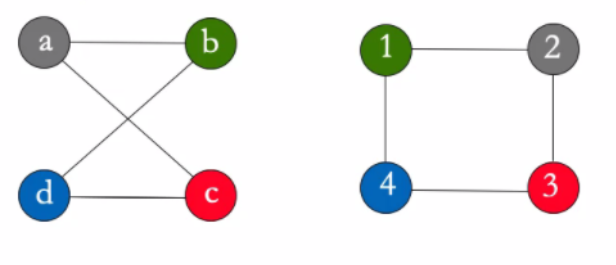
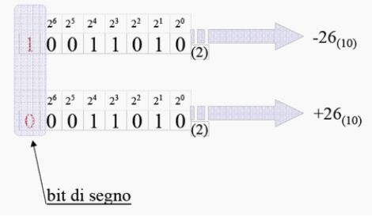

Giovanni Foletto, Stefano Viel, Carnelos Enrico - Primo anno ICE

# PROGRAMMAZIONE 1 - RICCARDI

# Obiettivi, Cos'è l'informatica e Introduzione all'informatica:

​	**Obiettivo**: conoscenza di base dell'informatica.

​	**Informatica**: dal francese, informazione automatica. Termine coniato da Ph. Dreyfus nel 1962

​	Questo significa che è l'insieme degli aspetti scientifici e tecnici che sono specificatamente applicati alla raccolta e al trattamento dell'informazione, in particolare all'elaborazione automatica dei dai. Ma anche lo studio sistematico degli algoritmi che descrivono e trasformano l'informazione.

## Algoritmi e linguaggi di programmazione:

Un **algoritmo** è una sequenza precisa di operazioni, comprensibili da un esecutore, che definisce una sequenza finita di passi che portano alla realizzazione di un compito (*task o problema*).

L'algoritmo ha alcune caratteristiche: (2 e 3 sono le più importanti)

1. deve essere **comprensibile** al suo esecutore (linguaggi di programmazione nel caso di un calcolatore). L'algoritmo così codificato viene chiamato *programma*.
2. deve essere **corretto ** (l'algoritmo ottiene la soluzione del compito cui è preposto, senza errori in nessun passo fondamentale).
3. deve essere **efficente** (l'algoritmo ottiene la soluzione usando la minor quantità di risorse).

DA NOTARE CHE: il concetto di algoritmo non è prerogativa dei calcolatori, ma semplicemente il calcolatore (in questo caso un computer) ha capacità di calcolo tali da gestire e lavorare con quantità di dati altrimenti intrattabili.

Gli algoritmi sono il modo in cui, implicitamente o esplicitamente, affrontiamo ogni problema nella vita di tutti i giorni. Questo problema viene chiamato **task**, e l'algoritmo serve a risolverlo.

Il problema dell'algoritmo della scelta invece crea un problema, il cosiddetto **il problema della segretaria**, che contiene una semplificazione matematica dell'algoritmo della scelta ottimale dal punto di vista matematico. 

Il concetto di questo problema è che dovendo scegliere di assumere una tra 100 segretarie, con l'unica remora che una volta assunta una, non si continua a cercare. L'algoritmo in questo caso direbbe di scegliere solo passati i primi 37% elementi (in questo caso segretarie), dopodichè, passato questo step, il primo che si dimostra all'altezza del compito anche in base alle persone viste in precedenza viene assunto e si chiude la ricerca.

(Vedi: https://www.smartworld.it/tecnologia/formula-matematica-decisioni-difficili-della-vita.html).

Dal concetto di ottimizzazione e rendimento dell'algoritmo si incontra anche il concetto di **reward**: ho due scelte, una usuale (**exploit**), un altra che cambia e esce dagli schemi (**explore**). La migliore dipende dal migliore risultato che le due rendono possibile.


### 	Il grafo

Per la rappresentazione di alcuni logaritmi è molto utile l'utilizzo del **grafo**. Il grafo è uno schema che collega tra loro le informazioni possedute, ottenute anche fonti diverse. Le informazioni così raccolte hanno il lato positivo di essere facilmente ricercabile, distinguibile e visibile. Inoltre rende evidenti i collegamenti che hanno tra loro. 

Questo tipo di schematizzazione, essendo molto ottimizzata e mettendo subito in risalto le informazioni che hanno contatti tra di loro, vengono ampiamente  utilizzati nell'intelligenza artificiale, permettendo appunto grandi elaborazioni. Il grafo quindi è un oggetto logico molto potente.

Un accortezza: con questa struttura è facile prendere due grafi uguali come diversi. I grafi si dicono **isomorfi** se hanno le stesse caratteristiche in termini di nodi e archi.




A questo punto però si crea un problema, infatti in alcuni casi, usando un dato algoritmo ottengo risultati diversi se non qualifico un qualche tipo di **parametro**. Proprio il concetto di parametro (inteso nel senso informatico, cioè elemento che caratterizza un determinato algoritmo e  che l'algoritmo si aspetta per eseguire un compito). I parametri quindi possono **condizionare l'esecuzione del task**.


### 	Come descrivere un algoritmo:

L'algoritmo per definizione è una sequenza precisa di passi, di conseguenza una lista non ordinata di elementi non è l'oggetto giusto per la sua rappresentazione. Inoltre il fatto che attraverso un parametro si possa ottenere un risultato diverso rende la sua codifica difficile. 

Innanzitutto è essenziale che sia descritto come un programma, cioè come una sequenza di istruzioni scritte in un linguaggio comprensibile al calcolatore. Il compito del programmatore è proprio quello di scrivere del codice che porti alla soluzione ottimale del problema. 

Per iniziare bisogna inizialmente **definire esattamente il problema**, che può essere:

1. problema di **puro calcolo e conversione**, cioè risolvibile attraverso conoscenze matematiche.
2. problemi di **decisione**, cioè capire se una certa proprietà è propria di un certo elemento. (es. 15467 è primo?).
3. problemi di **ricerca**, cioè trovare un elemento con determinate caratteristiche in un determinato insieme.

Il passaggio da definizione del problema a esecuzione del task poi passa da altri step, che sono necessari alla codifica e alla comprensione dei vari step:

1. Problema: linguaggio **Lp**, ovvero linguaggio naturale (per descrivere il problema).
2. Algoritmo: linguaggio **La**, ovvero lo pseudocodice (lascia meno incomprensione ma più difficile da leggere). 
3. Programma: linguaggio **Lt**, ovvero linguaggio macchina (es. C/C++).

Una volta eseguiti questi **macropassaggi** si può passare alla rifinitura del processo, attraverso dei **micro-algoritmi** (alcune volte il programma e l'algoritmo necessario al suo funzionamento sono così semplici da non necessitare la stesure di micro-algoritmi di supporto).

Su algoritmi molto complessi si può applicare la tecnica del **deconstruct**, ovvero decostruire il problema finché non si ottengono tanti problemi di facile soluzione.

Nel caso della stesura di un algoritmo si devono prendere in considerazione tutte le casistiche. Ad esempio se si scrive un algoritmo per cercare un libro bisogna anche tenere in considerazione la possibilità che questo libro non sia presente nell'indice della ricerca. Allo stesso modo non si può pensare di avere una differenza abissale di prestazioni se il libro è presente nella prima parte di indice o invece è in fondo. Ci sono di solito sempre più di un modo per risolvere problemi, quindi il problema principale diventa quello di trovare il modo più efficiente disponibile.


### 	La programmazione e il linguaggio di programmazione

Programmare innanzitutto significa analizzare un problema, progettare un algoritmo per ottenere una soluzione, esprimere l'algoritmo in un linguaggio di programmazione, mettere la macchina nella situazione di eseguire il programma e infine correggere eventuali errori.

L'algoritmo deve essere tradotto da linguaggio formale e reso comprensibile all'esecutore. L'insieme dei comandi dati al calcolatore in un certo linguaggio viene chiamato **programma**.

Il linguaggio di programmazione deve essere **rigoroso e preciso** dal punto di vista di:

1. **sintassi**: le regole che descrivono le stringhe di parole riconosciute dal linguaggio.
2. **semantica**: regole per l'interpretazione delle stringhe e che descrivono i processi computazionali dell'esecutore (o più semplicemente un errore logico nella stesura del programma, cioè un errore nella comprensione logica del programma). Questo errore è più difficile da individuare perché il compilatore non dà errore, ma i risultati saranno incoerenti.

Parlando di linguaggi di programmazione, bisogna dire anche qualcosa sull'astrazione del linguaggio: 

1. se il linguaggio è di bassissimo livello, quindi troppo vicino alla macchina è difficile programmare.

2. se il linguaggio è troppo di alto livello, quindi molto vicino al linguaggio del programmatore, i programmi diventano inefficienti.

   

Agli albori dell'informatica si programmava in linguaggio macchina, cioè compreso direttamente dalla macchina. 

Dagli anni '50 iniziano a nascere i primi linguaggi di programmazione di alto livello, data la sempre più alta complessità dei programmi.

Ad oggi esistono tantissimi linguaggi di programmazione, ognuno con il suo scopo e inventato per esigenze diverse.


### 		Metodo grafico per creare algoritmi:

Gli algoritmi possono essere schematizzati anche attraverso diagrammi di flusso, cioè blocchi orientati che hanno un significato proprio.


CARATTERISTICHE: 

- BLOCCO **INIZIO**: unico nodo del grafo da cui si può solo partire infatti  ha una sola freccia uscente. Rettangolo rosso per convenzione. Di solito si definisce con '1' l'inizio.
- BLOCCO **FINE**: blocco in cui si può solo arrivare infatti ha una sola freccia entrante. Rettangoli rossi per convenzione. Di solito si definisce con '0' la fine.
- BLOCCO **ISTRUZIONE**: 
  - **assegnazione**: dà il valore che c'è a sinistra alla variabile di destra.
  - **I/O**: (input/output), si sta leggendo o scrivendo
  - **controllo**: (con più uscite, in questo caso vero e falso) 


## Architettura hardware di un compilatore:

### 	Storia del Calcolatore:

Il primo calcolatore definito tale è ENIAC, creato nel 1945 in America con il principale scopo di calcolare la traiettoria dell'artiglieria. Poi donato al University of Pennsylvania, dove invece venne usato per il calcolo ingegneristico e scientifico. Pesava circa 27 tonnellate e per programmarlo erano necessarie diverse persone, infatti si basava su una *plugbboard* cioè un sistema di "prese" che, usate per fare il contatto giusto, fornivano risultati alle operazioni date come input. Non esisteva un linguaggio di programmazione pe questo computer e i cosiddetti "programmatori" dell'epoca probabilmente non lo hanno mai visto in tutta la loro vita, dato che loro facevano solo i calcoli per farlo funzionare e poi qualcun altro si occupava di creare i giusti collegamenti. La sua potenza di calcolo era tale da permettere di calcolare quello che un uomo avrebbe fatto in 20 ore in soli 30 secondi. Aveva un clock di circa 100kHz, e garantiva una vasta quantità di calcoli possibili.

Dopo la seconda guerra mondiale inizia effettivamente lo sviluppo di una macchina più vicina all'immaginari comune. Sempre più comuni diventano:

1. MAINFRAME: computer di grandi dimensioni ed elevata potenza, solitamente condiviso fra più persone/uffici.
2. PERSONAL COMPUTER: computer dotati di tastiera e schermo separati, di memoria di massa interni o esterni alla memoria centrale e molto più economico. 
3. LAPTOP: computer portatile, nonché evoluzione portabile del personal computer. Diventa molto famoso e utilizzato. Diventano così sofisticati che inizia il processo di miniaturizzazione dato che si poteva fare con le tecnologie disponibili ormai.
4. HANDHELD COMPUTER (SMARTPHONE): cellulari dotati di touchscreen, molto portabili e maneggevoli. Anche con questi come con i laptop avviene il processo di miniaturizzazione.
5. WHERABLE COMPUTER: sono computer così miniaturizzati da poter essere messi all'interno di un orologio, o un altro oggetto facilmente indossabile. Questi solamente sono caratterizzati da una gamma di sensori solitamente molto avanzati che possono servire per monitorare lo stato di salute o altri scopi.

La miniaturizzazione che è avvenuta è dovuta alla possibilità di dimezzare la grandezza del transistor per un certa quantità di volte, data dalla legge di Moore.


Moore infatti nel 1965 ipotizza che il numero di transistor inseribili nei microprocessori sarebbe raddoppiato ogni anno. La sua previsione si rivela corretta, finché verso la fine degli anni '80 viene riformulata: raddoppio del numero di transistori ogni 18 mesi. 

Per aumentare ancora più le prestazioni si cerca di aumentare il clock dei processori stessi. Il **clock** di un processore è il dato che indica la quantità di calcoli può fare al secondo. Al momento il dato del clock è pressoché fermo intorno al dato di 3gHz. Questo stop è dovuto al problema fisico per cui aumentando troppo il clock, il calore emesso diventa esponenzialmente maggiore. Di conseguenza quando si sono provati clock più alti si ha avuto problemi di gestione delle temperature eccessivamente alte. Per ovviare questo problema si apre un'altra strada: il multithreading o clock distribuito ad albero. Questo permette di passare il clock in tutte le parti del processore e rendere quindi i processi sincronizzati, utilizzando la potenza di tutte le parti assieme e quindi garantendo una maggior potenza.


### 	Organizzare il software di un calcolatore

Il normale schema di un calcolatore è (generalmente) così costruito:


Per leggere questo schema bisogna capire che: 

1. Tutto si basa su quello che ha sotto di se e può comunicare solo con i blocchi a se adiacenti. (ad es. il software di sistema non si interfaccia direttamente con l'hardware, passa attraverso il sistema operativo).
2. L'unico che può operare con l'hardware è il sistema operativo. Questo ne gestisce tutte le componenti.


### 	Architettura Hardware:


L'architettura hardware sopra è nota con il nome di **Macchina di Von Neumann** ed è così costituita:

1. **CPU** (central processing unit): svolge l'elaborazione eseguendo i programmi logici.
2. **MEMORIA CENTRALE **: memoria utilizzata per memorizzare dati e istruzioni, volatile (usata quindi solo per l'esecuzione di programmi).
3. **MEMORIA DI MASSA **: usata per memorizzare grandi quantità di dati e programmi in maniera persistente, al contrario della memoria centrale.
4. **PERIFERICHE**: sono di vario tipo e servono a tutto quello che permette l'interazione con il calcolatore. (ad es. tastiera, monitor, stampante, ..).
5. **BUS DI SISTEMA**: elemento che interconnette gli altri componenti consentendo lo scambio di dati, quindi anche il collegamento fra periferiche e hardware.


### 	Macchina di Von Neumann:

#### CPU: unità di elaborazione

La CPU è l'unità di elaborazione del calcolatore, si occupa di caricare le istruzioni in memoria centrale, interpretarle e eseguirle.

E' altamente specializzata, perché è pensata per eseguire pochi tipi di operazioni ma molto velocemente. 

Il suo lavoro è scandito dal **clock** (orologio interno). La potenza del calcolatore dipende in parte dal clock, infatti quanto più questo è alto, tante più sono le istruzioni che riesce ad eseguire al secondo. La sua frequenza infatti viene misurata in Hz, e 1 Hz = 1 ciclo/s. Ad oggi le CPU riescono a lavorare in parallelo, il cosiddetto "lavoro condiviso", grazie al clock. Infatti il segnale del clock che arriva a tutti sincronizzato permette di eseguire azioni contemporaneamente.

#### Memoria centrale:

La memoria centrale è destinata a accogliere dati e programmi sui quali opera il calcolatore. (ad es. quando usiamo il computer qui vengono memorizzati i dati di programmi che stiamo usando, ...). La memoria centrale è velocissima ma volatile (cioè una volta che il programma finisce, tutti i dati di un programma vengono cancellati e lo spazio viene liberato). Questa memoria accoglie i dati necessari a far funzionare i programmi. Concettualmente è composta da una sequenza di celle ognuna delle quali contiene una parola (**word**). Ad ogni cella si può accedere direttamente specificandone l'**indirizzo**, e accedendone si può cambiare il suo contenuto (read/write). La quantità di bit da cui è composta la word dipende dalla macchina, infatti è caratteristico del microprocessore e attraverso questo si identifica lo spazio di indirizzamento. 

La memoria centrale solitamente è realizzata da una **RAM** (random access memory). La sua caratteristica è che ogni cosa è accessibile e non devo scansionare tutti gli indirizzi per cercare la cella che ho bisogno. (per es. non è come il nastro magnetico che devono fisicamente essere spostate avanti e indietro per trovare l'informazione cercata). Questo ha ricadute dirette sul tempo di accesso, che è indipendente dall'indirizzo della word che si vuole accedere. Questa è una memoria volatile quindi i dati presenti qui sopra si perdono quando si spegne la macchina. Esistono SRAM (static RAM), molto veloce, può contenere pochi dati acceduti molto frequentemente, e DRAM (dynamic RAM) che contiene più dati, ma più lentamente.

Altri tipi di memoria presenti sono le **ROM** (read-only memory). Hanno caratteristiche simile alle RAM, hanno un accesso veloce ai dati (ma non come quello delle RAM) e si tratta di **memorie permanenti** su cui però non si può scrivere. Tipicamente son utilizzate per memorizzare dati e programmi che servono prima del caricamento del Sistema Operativo (ad es. per il caricamento del BIOS = Basic Input-Output System).

La memoria quindi com'è fatta? Appare come una lista di word cioè un mattoncino composto da 16bit, di conseguenza posso memorizzare tanti dai quanti 2^16 valori binari. All'interno della memoria ci posso mettere tante word come gli indirizzi di memoria che sono 1024, e sono assegnati da 0 a 1023. Se questi fossero i limiti del tuo microprocessore allora devi fare in modo che all'interno di questo spazio di memoria ci stiano i dati e i programmi necessari al tuo scopo.

Per questo motivo in memoria non si può accedere a valori più grandi di 2^16 e non si può accedere all'indirizzo 1024.


Però poi a questa memoria si deve poter accedere, quindi nella CPU esistono dei registri, che sono word di memoria chiamate così per distinguerle da quelle in memoria centrale. Questi registri possono essere:

1. AR (Address Register): di almeno 10 bit, perché in questo caso posso indirizzare da 0 a 1023
2. DR (data Register): posto in cui i dati di cui la CPU ha bisogno per fare operazioni che vengono copiati in questa posizione dalla memoria centrale per rendere le informazioni direttamente disponibili alla CPU.

I registri sono elementi di supporto al calcolo.

#### Gerarchia di memoria

Ci sono a disposizione memorie con caratteristiche diverse in base al loro scopo:

1. Registri: presenti nella CPU, piccoli ma veloci, utili per contenere dati temporanei per le operazioni della CPU
2. Memoria cache (SRAM): veloce, contiene pochi dati usati/richiesti frequentemente
3. Memoria principale (DRAM): meno veloce ma contiene più dati
4. Memoria secondaria o di Massa: molti dati, indicativamente più lenti (anche se gli SSD consentono un vantaggio prestazionale rispetto agli HD o agli HHD).

#### Rappresentazione dell'informazione:

Tutti i dati vengono solitamente rappresentati in maniera **binaria**, ovvero il bit che può prendere il valore 0 o 1. Questo è molto utile perché si basano strutturalmente basati su dispositivi bistabili (corrente ON o corrente OFF). Per questo l'elaboratore elettronico può operare solo su sequenze di simboli binari. 

Il BIT (derivato da Bynary digIT) è quindi l'unità elementare dell'informazione. Comandi e dati nel computer vengono quindi rappresentati con lunghe sequenze di numeri binari.

Essendo tutto codificabile attraverso il bit, allora sono state inventate strutture per contenere la rappresentazione figurata della realtà. Ad esempio la convenzione ASCII, poi diventata extended-ASCII, ha codificato i caratteri come sequenza di 8bit, il **byte**.


Per i multipli del byte si adottano gli stessi simboli del sistema decimale, ma visto che gli elementi sono in base 2, il fattore di scala è leggermente diverso:


#### Funzionamento della CPU:

Innanzitutto bisogna dire che:

1. il trasferimento dei dati avviene con il bus di sistema.
2.  Le fasi di elaborazione si susseguono in modo sincrono rispetto all'orologio di sistema (clock).
3.  Durante ogni intervallo di tempo **l'unità di controllo** (che fa parte del processore) stabilisce la funzione da svolgere.
4. L'intera macchina opera in maniera sequenziale (però architetture più evolute prevedono l'esecuzione parallela delle istruzioni).

  

Come si vede dall'immagine la CPU ha a disposizione vari elementi:

1. i registri (PC, INTR, CIR, DR, AR, ...)
   * registro di stato della CPU (**SR**)(FLAG: C, Z, S, V), serve a far capire al compilatore lo stato delle periferiche e delle varie parti del compilatore stesso.
   * Il program counter (**PC**) indica gli indirizzi dove andare a prendere la prossima istruzione.
   * registro istruzioni (**INTR**) segnale lo stato di funzionamento delle periferiche.
2. unità di controllo: capacità di controllare quello che sta succedendo, in pratica manda segnali per impartire degli ordini, in particolare possono provenire da questa unità il segnale di prelievo, di decodifica e d'esecuzione dell'istruzione.
3. Unità ALO: oggetto che esegue le operazioni aritmetico-logiche.
4. si nota il BUS di SISTEMA, responsabile di collegarsi ai vari registri e alle varie periferiche. (sotto)


Il Ciclo base di funzionamento della CPU: (visione ad alto livello)

1. FETCH
   1. La CU manda un segnale affinché il PC sia spostato nel AR (cioè la prossima istruzione viene indicizzata).
   2. segnale controllo (read) alla memoria centrale posto all'indirizzo in AR.
   3. il dato letto viene messo a disposizione nel DR (registro dei dati).
   4. la CU manda il segnale di controllo affinché il contenuto di DR sia spostato nel CIR (registro istruzione corrente).
2.  INTERPRETAZIONE: le informazioni sul CIR vengono decodificate dalla CU.
3. ESECUZIONE: la CU genera una sequenza di segnali di controllo necessari a eseguire l'istruzione.
4. il PC viene incrementato per puntare alla prossima istruzione.

Durante l'esecuzione la CPU può eseguire 3 macro-tipologie di istruzioni:

1. Istruzioni aritmetiche.
2. istruzioni di controllo.
3. istruzione di trasferimento dei dati (sia registro-registro, sia memoria-memoria, sia memoria-registro, sia registro-memoria).


#### Il Bus di Sistema

Il bus di sistema è l'elemento che interconnette le varie periferiche e i vari elementi del calcolatore. In ogni istante il bus è dedicato al collegare due unità, una che trasmette e una che riceve. Il processore esegue il *bus mastering*, ovvero seleziona le connessioni da attivare e indica l'operazione da svolgere.  Il bus è suddiviso in tre insiemi di linee: *bus dati*, *bus indirizzi* e *linee di controllo* (quest'ultime trasportano informazioni relative alla modalità di trasferimento e alla temporizzazione). 

Il Bus di sistema ha l'organizzazione della comunicazione cosiddetta *master/slave*, ovvero ci sono parti (*slave*) che devono sempre ascoltarne altre (i *master*). Generalmente il master è l'elemento di controllo, nonché quello che manda i segnali di esecuzione.


#### Le periferiche: memorie di massa

Con il termine memoria di massa ci si riferisce a un dispositivo di memorizzazione permanente capace di contenere grosse quantità di dati.

Possono essere: fissi o rimovibili, ad accesso sequenziale o casuale, dispositivi in sola lettura(RO), in lettura scrittura (RW), o WORM (Write Once Read Many), dispositivi magnetici, ottici o magnetico-ottici.

1. HARD DISK

   Sfruttano le proprietà magnetiche di alcuni materiali (sostanze ferromagnetiche) di poter assumere a comando una certa direzione di magnetizzazione. A ciascuna direzione associa un simbolo binario. Sono costituiti da micro-celle magnetizzabili indipendentemente. La magnetizzazione è semipermanente, cioè rimane anche in assenza di mancanza di corrente ma può essere modificata.

2. MEMORIE DI MASSA: HDD

   Usa uno schema di memorizzazione creato in fase di formattazione di basso livello. Ogni superficie è divisa in tracce concentriche. I dati sono memorizzati in maniera sequenziale. Ogni traccia è divisa in settori. L'insieme delle tracce omologhe poste su diverse facce è detto cilindro.

3. SSD: MEMORIE ALLO STATO SOLIDI

   Accesso completamente elettronico (invece che elettromagnetico) ai dati. Al momento costi maggiori per unità di memoria. Permettono uno start-up immediato, latenza molto bassa e velocità di trasferimento circa un ordine di grandezza maggiore rispetto agli hard disk. 

4. RAID

   Per aumentare le prestazioni dei sistemi a disco è possibile raggruppare più dischi in un sistema RAID (Redundant Array of Inexpensive Disk). Questo sistema suddivide i file in blocchi registrati su dischi diversi per aumentare le prestazioni (data striping). Questo sistema è anche utilizzato per incrementare l'affidabilità dei sistemi a disco attraverso un meccanismo di ridondanza.


#### L'interfaccia delle Periferiche


Comunicare con le periferiche può essere complicato, infatti se si dovesse avere del codice per parlare con ogni singola periferica il lavoro del programmatore diventerebbe impossibile. Per questo esiste un'interfaccia, che fa come da traduttore tra il linguaggio della periferica e la macchina.

E' possibile avere un interfaccia diversa per ogni periferica, ma è più logico avere delle interfacce standard per periferiche simili. (Ad es. USB: Universal Serial Bus).

Questa interfaccia si occupa concettualmente della gestione e dello scambio di dati tra il processore e le periferiche. In generale contiene:

1. un registro dati della periferica
2. un registro di comando della periferica
3. un registro di stato (questo talvolta collegato al registro delle interruzioni del processore)

A seconda del processore e dei registri delle periferiche, le interfacce possono:

1. condividere lo spazio di indirizzi della memoria (memory mapped I/O)
2. adottare uno spazio di istruzioni/indirizzi distinti (port mapped I/O) 

Le periferiche attraverso le interfacce possono essere gestite con due metodi principalmente: 

1. POLLING: il processore invia sul bus il comando di lettura e si mette in attesa che il dato sia disponibile sul registro della periferica attraverso continui cicli. (PRO: facile implementazione e gestione; CONTRO: tiene sospeso il processore nel ciclo di attesa del dato).
2. INTERRUPT: il processore invia il comando di lettura alla periferica e poi continua le sue operazioni. Quando il dato è disponibile sul registro della periferica, la periferica stessa "solleva" un *interrupt*, un interruzione. Il processore così interrompe le sue operazioni, salva il proprio stato ed esegue una opportuna routine per la gestione delle interruzione (compito del sistema operativo). Questa routine serve a verificare la presenza del dato sulla periferica del dato e a iniziare il trasferimento nel registro interni al processore, fino ad arrivare in memoria. Alla fine dell'*interrupt* il processore ritorna alle sue operazioni normali. (PRO: lascia più libero il processore di operare; CONTRO: gestione, implementazione e controllo più complicati).

Tra le periferiche sono presenti anche i terminali, cioè qualunque dispositivo di puntamento (tastiera, mouse, video ...), e le stampanti.


### Architettura software di un compilatore:


Con il termine *sistema operativo* intendiamo l'insieme di programmi che opera direttamente sulla macchina fisica, fornendo interfacce di alto livello e mascherandone le caratteristiche specifiche delle periferiche e del processore. Questo ad esempio è molto utile nella gestione delle periferiche, perché permette di fornire un metodo *consistente* delle periferiche, ovvero una modalità standard di interfacciarsi con le periferiche disponibili senza dover eseguire comandi di basso livello. Importante notare inoltre che il sistema operativo è l'unico elemento con accesso diretto alle risorse hardware, e si riesce ad accedervi in altro modo direttamente probabilmente abbiamo un problema.

Il sistema operativo è il modo che consente ai programmi di ottenere risorse dal calcolatore. La traduzione da programma a calcolatore avviene ad alto livello, in modo che non si debba scontrarsi con la gestione degli indirizzi o dei registri. Il sistema operativo quindi, dovendo gestire tutte le funzionalità di basso livello attraverso dei controlli di alto livello, opera un alto livello di astrazione del linguaggio macchina.

### 	Storia dei sistemi operativi:

Nel 1982 Kernigham introduce Unix, prodotto dai laboratori AT&T, che al tempo avevano grandi esigenze di un ecosistema stabile e uguale su cui sviluppare applicazioni. Caratteristica principale: poteva servire più utenti contemporaneamente, usando il multitasking. Tutti gli utenti infatti hanno un ordine di esecuzione al processore, ma sono tutti nell'ordine del proprio utente. Da Unix poi si svilupperanno tutti i sistemi operativi che tuttora conosciamo (Come MS-DOS o Linux).


Architettura di un SO, che ad oggi è organizzato secondo un architettura a *strati* (anche detta *onion skin architecture*). Ogni strato fornisce un astrazione dello strato sui cui si appoggia e permette una chiara separazione tra interfaccia e implementazione delle diverse funzionalità, oltre che a fornire l'insieme di programmi e librerie.


Il *kernel* del sistema operativo, ovvero il cuore dell'OS si occupa di:

- gestione periferiche (I/O informazioni)
- gestione memoria (Fornisce/non fornisce al memoria in base al carico del momento, stabilisce il tipo di memoria da fornire)
- gestione dei processi

Un processo è un entità dinamica, contrariamente al programma, infatti viene causato dal codice in esecuzione (*programma*) e dal suo stato di esecuzione (es. valore delle sue variabili).

Un processo è quindi un insieme di due elementi:

- E: il codice eseguibile del programma (questo fa partire il fetch per creare un processo)
- S: lo stato del processo

Logicamente il processo non viene gestito direttamente dal processore reale, se no verrebbe meno il concetto di multitasking. Il processore crea dei processori virtuali che si comportano similmente e che possono essere assegnati a un processo.


Nel processore è possibile che ci sia un solo processo in esecuzione in ogni istante, mentre gli altri processi sono pronti o in attesa. Ad ogni processo viene assegnato un valore massimo di tempo di esecuzione, scaduto tale viene revocato il processore virtuale e assegnato a un altro processo. Questa tecnica è detta di time-sharing, viene eseguito dal nucleo che decide da quali processi devono andare in esecuzione determinando lo *scheduling*, che è sequenziale. La soluzione tipica per la gestione del tempo di esecuzione di processi è a turno (*round-robin*, tutti i processi in questo hanno la stessa priorità ad essere eseguiti, nella realtà non funziona perché alcuni processi hanno la priorità). La CPU viene rilasciata anche quando un processo sta aspettando un I/O da/verso una periferica.

x

In questa complicata gestione delle risorse prende parte anche la gestione della memoria, che pensa al partizionamento della memoria tra i vari processi che la richiedono garantendo la protezione/separazione fra le diverse zone allocate. Il gestore memoria gestisce anche la memoria che va assegnata ai processi, e quando i processi finisco la memoria fisica si occupa di creare una memoria virtuale (più lenta di solito, chiamata SWAP o semplicemente memoria virtuale) e assegnare quella memoria.


# THE C PROGRAMMING LANGUAGE:

Ci sono principalmente 3 tipi di programmazione:

* programmazione per HARDWARE, ovvero la programmazione di dispositivi fisico/logici il cui il linguaggio di programmazione coincide con il linguaggio macchina. 
* programmazione per FIRMWARE, ovvero la programmazione che usa un'insieme comune di istruzioni mediante assembly, ovvero linguaggio di programmazione molto basso
* programmazione per SOFTWARE, ovvero programmare in un linguaggio intermedio che simula le funzionalità della macchina fisica, che per questo permette maggiore flessibilità (nel senso che posso realizzare un gran numero di programmi diversi e con funzioni diverse), ma che ha un utilizzo delle risorse meno efficiente.

Il sistema operativo prende parte molto nell'ultimo caso, infatti è suo il compito di fornirci le periferiche necessarie a fornire la traduzione da linguaggio macchina (che usano ad esempio nella programmazione firmware) e il codice. L'OS si occupa anche dell'astrazione degli oggetti e/o delle istruzioni complesse di alto livello.

## Diffusione dei linguaggi e Perché il C

Ci sono tantissimi linguaggi di programmazione creati o utilizzati per specifici utilizzi in cui sono molto apprezzati. Linguaggi più standard di medio-basso livello come il C o il C++ permettono una maggior comprensione del funzionamento della maggior parte degli altri linguaggi, che in alcuni casi forniscono astrazioni alle strutture di basso livello ancora presenti in questi.

Il C presenta una serie di elementi che lo rendono importante da imparare:

* permette l'allocazione dinamica e altri aspetti normalmente di alto livello, a un livello basso.
* gestione della memoria molto manuale
* linguaggio apprezzato/richiesto dalle aziende
* ha un astrazione che è posizionata tra il medio e il basso livello, motivo per cui è molto utile per ad. es. embedded system.

Il linguaggio C è stato creato nel 1972 da Kernighan e Ritchie ai Bell Tel. Labs. 

## Operazioni Logiche (algebra di Boole)

L'algebra di Boole è basata su tre operatori logici (NOT, AND, OR). Gli operandi posso assumere due valori: VERO e FALSO. 

Gli operatori godono della proprietà 

- commutativa  (es. A OR B = B OR A)
- distributiva  (es. A AND (B OR C) = (A AND B) OR (A AND C))

Le tabelle di verità associano a tutti i possibili valori degli operandi il risultato


solitamente NOT viene rappresentata con !, AND con && e OR con ||.

quando si valuta un espressione l'ordine è il seguente (NOT, AND, OR), per esempio.


Per calcolare il risultato di un espressione (per esempio NOT Y AND (Y OR NOT X)) si crea una tabella di verità, prima con i valori singoli per poi raggrupparli fino ad arrivare alla formula di partenza. 


### Leggi di De Morgan

* A AND B = NOT ((NOT A) OR (NOT B))
* A OR B = NOT ((NOT A) AND (NOTB))

si possono dimostrare compilando la tabella di verità e osservando che le tabelle delle espressione ai due lati dell'uguale hanno stessi risultati a parità di input. 

**Tautologia**: espressione che è sempre vera

**Contradizione**: espressione sempre falsa

## Codifica Semplici Algoritmi in C

istruzione di assegnamento:

```c++
x = 23;
w = 'a';
y = z;
```


### Costruttore if-else

diagramma di flusso:


L'espressione tra parentesi viene valutata, se vera viene eseguito il primo blocco, se falsa l'altro. Naturalmente si può utilizzare anche l' if da solo senza else.  All'interno dell'espressione posso utilizzare gli operatori logici (&&, ||).

è sempre meglio utilizzare indentazione e paretesi graffe per una migliore leggibilità e per non commettere errori. 

**Operatore ternario `?`* *è un altro modo di scrivere if-else, la sintassi è la seguente

```c++
espressione1 ? espressione2 : espressione3; //questo equivale al seguente if-else

if (espressione1)
	{ espressione2; }
else
	{ espressione3; }
```

dopo le parentesi graffe il ; non è necessario, ma se viene messo non c'è errore. 


### Precedenza degli operatori

In un espressione vengono eseguiti prima gli operatori con precedenza superiore, se gli operatori sono dello stesso gruppo si usano le regole di associatività (da destra o da sinistra), le parentesi posso essere usate per modificare la precedenza. 

Associatività da sinistra a destra significa che a parità di priorità l'espressione viene eseguita partendo da sinistra a destra. 


```c++
if (a + b – 4 <= 9 && x < tot -1 ) // questa espressione è equivalente a quella sotto
    
if (((a + b – 4) <= 9) && (x < tot -1) )
```


### Istruzione Iterativa ( ciclo )

il diagramma di flusso è il seguente (il ciclo si chiama while). Il blocco istruzioni viene ripetuto fino a quando l'espressione non diventa falsa. 


(da pagina 38 a 56 un po' di esercizi noiosi)

### Getchar e Putchar

```c++
//getchar legge il prossimo carattere inserito da tastiera
c = getchar();
//putchar stampa il carattere nello standard output
putchar(c)
```


##### Esercizio scale:

Sia data una scala di N gradini. Si supponga di salire l’intera scala con passi da 1 , 2 o 3 scalini. In quanti possibili modi si può salire l’intera scala ?

**risoluzione in modo semplice:** 

Devo capire in quanti modi possibili posso salire una scala con n gradini. Posso compiere passi da 1, 2 o 3 gradini. 

Mi calcolo in quanti modi posso salire una scala formata da 1 2 o 3 gradini e basta.

Un gradino = 1 modo 

Due gradino = 2 modo 

Tre gradino = 4 modo 

Per arrivare al quarto gradino ho solo tre possibilità: fare un passo da uno, da due o da tre, quindi devo arrivare al gradino 4-1, 4-2, 4-3, siccome so già quanti passi ci vogliono per arrivare in questi posti, basta sommarli assieme per capire il numero di passi per arrivare al quarto. 

Aggiorno il numero di passi per il gradino n-1, n-2, n-3 e vado avanti.   (se non si capisce chiedetemi che vi spiego meglio).

### Strutture di controllo

#### Istruzione di ciclo: `FOR`

schema a blocchi e sintassi: 


questo operatore è utile quando so a priori quante operazioni devo fare, in quei casi è più compatto rispetto ad un while.


#### Il costrutto `DO-WHILE`

schema a blocchi e sintassi:


```c++
// un esempio
Contatore = 0;
do
{
    scanf (" %c", &Dato);
    Contatore ++;
} while (Dato != '%’);
```

si utilizza quando voglio eseguire un blocco di istruzioni almeno una volta, può essere utile quando devo fare un controllo sull'input da tastiera.


#### Il costrutto `SWITH`

Va a sostituire un if-else multiplo, schema a blocchi e sintassi:


Il **default** (le istruzioni che vengono eseguite in caso che nessuna delle altre sia vera) è opzionale. I singoli case vengono eseguiti quando il valore dell'espressione è uguale a quello scritto appena dopo l'istruzione case. ATTENZIONE: bisogna mettere il break dopo il blocco istruzioni altrimenti si rimane all'interno dello switch (verranno valutati i case seguenti ed eseguito il default se presente).

Valuta solo variabili di tipo INT, quindi l'espressione deve avere come risultato un int.

**Break**: quando viene eseguito all'interno di un while, for, do, switch provoca l'uscita dall'istruzione

**Continue**:  quando viene eseguito all'interno di un ciclo passa alla iterazione successiva

un linguaggio di programmazione può codificare qualsiasi algoritmo se ha: sequenza di istruzioni, if-else e while.

## Array in C

Gli array possono essere paragonati a vettori e matrici in matematica. Da un punto di vista più concreto sono una sequenza di celle di memoria consecutive e omogenee. L'array è quindi un contenitore per *variabili dello stesso tipo*. 

A ciascun elemento dell’array si accede tramite indice (esempio a[i] è l'elemento alla posizione i-esima). Le parentesi quadre sono operatori ad alta precedenza (sono al primo livello della tabella).

Il primo elemento dell'array è quello in posizione 0, la macchina astratta prende l'indice e lo somma all'indirizzo della prima cella dell'array. 

Prima di utilizzare le array bisogna dichiararle: 

```c++
int a[100]; // dichiara un contenitore a (array) che potrà contenere 100 elementi di tipo int, il primo elemento lo si trova in a[0], l'ultimo in a[99]
```

il compilatore va a riservare la memoria per tutti questi elementi


In generale l'ultimo elemento dell'array è nella posizione n-1, dove n è la lunghezza dell'array stessa. All'interno delle parentesi si possono mettere delle espressioni. Un veloce esercizio: 


SOLUZIONE: a[0]= indeterminato, a[1] = 6

ATTENZIONE: se vado oltre l'indice massimo dell'array accedo a celle di memoria che non appartengono all'array e il cui valore è indeterminato. 

L'array in C non è un tipo, ma un costruttore di tipo. 

### Inizializzazione e stampa

si può inizializzare direttamente al momento della dichiarazione

```c++
int a[5] = {5, 2, -5, 10, 234};
int b[4] = {5, 2, -5}; //un elemento non è inizializzato
int c[2] = {5, 2, -5}; // ERRORE: inizializzato un elemento che non appartiene all'array
```

per array grandi questo metodo diventa scomodo, quindi si usano i cicli per inizializzare. 

anche per stampare un array devo utilizzare un ciclo

```c++
printf("%d", a); // errato perchè a è un array

int i=0; // questo è il procedimento corretto
while (i<5){
    printf("%d",a[i]);
    i++;
} 
```

esercizi sulle array dalla slide 31 a 41.

**Array dinamici**: il C permette inizializzare la dimensione di un array durante l'esecuzione di un programma (per esempio chiedendo la dimensione da tastiera).


### Array multidimensionali

Le array di due dimensioni corrispondo alle matrici in matematica. Si dichiarano nel seguente modo: 

```c++
int a[N][M]; //N numero righe M numero colonne

//è anche possibile definire più dimensioni
int a[10][5][20];
```

Come per gli array ad 1 dimensione, anche questi possono essere inizializzati nella fase di dichiarazione:

```c++
int a[4][5]= { {2, 5, -8, 7, 6},
                {3, 10, 7, 6, 1},
                {-1,8, -8, 5, 3},
                {2, 5, 8, 4, 2}
			 };
```

Per semplicità possiamo immaginare l'array in due o più dimensioni, ma la macchina astratta del C memorizza gli elementi uno dietro l'altro. Per esempio l'array creata sopra verrà memorizzata nel seguente modo: 


altri esempi di inizializzazione corretta e sbagliata: 

```c++
int D[][]={1,2,3,4}; // errata
int E[2][]={1,2,3,4}; //errore non viene specificato il numero di colonne

int F[][4]={{1,2,3,4}}; //va bene 
// in c nella dichiarazione di un array bisogna valorizzare tutte le dimensioni, si può fare a meno di quella più a sinistra 
```

le array possono anche essere inizializzate con dei cicli

```c++
int main(int argc, char *argv[]){
    int matrice[10][5];
    int i=0,j=0;
    while (i<10)
    {
        j=0;
        while (j<5)
        {
            printf("%d ",matrice[i][j]);
            j++;
        }
        printf("\n");
        i++;
	}
}
```

esercizi da pagina 61 in poi

## Stringhe in C

Un array di char può essere rappresentata con una stringa (per esempio "hello"). L'ultimo carattere deve essere il carattere nullo '\0'. Questo carattere serve alle varie funzioni per capire dove terminerà la stringa. Quindi quando vado a creare una stringa per memorizzare n caratteri ne serviranno n+1 (uno lo uso per il carattere nullo).

Esiste un modo semplificato per inizializzare un'array di caratteri come stringa: 

```c++
char mia_stringa[] = “Ciao a tutti!”;
```

Questo mi memorizza automaticamente lo spazio per il miei caratteri più il carattere terminatore. Quindi il risultato sarà: 


L'inizializzazione vista sopra è molto più veloce ed è equivalente ad inizializzare nel seguente modo: 

```c++
char mia_stringa[] = {‘C’,‘i’,‘a’,’o’,’ ‘,’a’,’ ‘,’t’,’u’,’t’,’t’,’i’,’!’,’\0’};
```

Se non specifico il numero all'interno delle parentesi quadre quando dichiaro l'array il compilatore va a riservare uno spazio pari al numero degli elementi con cui l'array viene inizializzato. Nel caso delle stringhe posso anche dichiarare esplicitamente la dimensione di memoria da riservare: 

```c++
char frase[20]=”Ciao a tutti!”;
```

Bisogna stare attenti che un elemento (dei 20 messi a disposizione per l'array) sarà occupato da '\0' e poi gli elementi in più saranno lasciati vuoti. 

ATTENZIONE: se non specifico né il numero di caratteri (all'interno delle parentesi quadre) né assegno alla stringa un valore, il compilatore da un errore, perché non sa quanta memoria riservare.

```
char parola[]; // ERRORE
```

per stampa le stringhe si usa %s:

```c++
printf(“%s”, mia_stringa); //questo non sarebbe possibile se non ci fosse il carattere terminatore perché non saprei dove fermarmi 
```

quando faccio scanf non bisogna mettere la & perché la stringa è un array e la variabile con il suo nome è già un indirizzo.

```c++
scanf(“%s”, parola);
```

## Rappresentazione di informazioni

in un calcolatore le informazioni vengono rappresentate sotto forma di dati, codificati in un linguaggio comprensibile al calcolatore. Per permetterci di interpretare le informazioni i dati devono essere decodificati. Quindi ci sono diversi livelli di decodifica che partono dall'hardware fino ad arrivare ad informazioni interpretabili a noi umani. 


I tipi di dato che il calcolatore può interpretare direttamente sono :

* booleani 
* numeri interi
* numeri frazionari
* caratteri

Per questi dati la codifica è gestita direttamente dall'HW, per tipi di dato più complessi si usa una rappresentazione di tipo software. 

### Interi 

Sono rappresentati da una sequenza finita di bit. 8 bit (un byte) permettono di rappresentare i valori da 0 a 255. Solitamente per gli interi positivi si usano 4 byte (32 bit), quindi i numeri vanno da 0 a 4.294.967.295. (questo implica che all'interno dei calcolatori i numeri sono finiti).

Per rappresentare anche i numeri negativi, si utilizza il primo bit come bit di segno (0 per i numeri negativi, 1 per i positivi)



In realtà nei calcolatori non si usa questa rappresentazione ma quella in complemento a due con i seguenti vantaggi: non c'è un doppio zero, non c'è bisogno di una circuiteria specifica. Esempio: 


Per decodificare i valori positivi si procede nel modo normale, per quelli negativi si decodifica e poi si sottrae 2^N-1. Per invertire i numeri si invertono gli zeri con gli uno e si somma uno.

#### Numeri frazionari

I dati con numeri dopo la virgola vanno rappresentati in maniera opportuna, ci sono due tecniche: 

* **virgola fissa**: si dividono i bit che rappresentano i valori interi da quello per i valori dopo la virgola
* **virgola mobile**: la maggior parte dei bit viene usata per le cifre rappresentative del numero, gli altri per sapere dove mettere la virgola. 

esempio codifica virgola fissa:


Per la virgola mobile solitamente vengono utilizzati 32 bit, 1 per il segno, 8 per l'esponente e il resto per la mantissa


Quindi la mantissa rappresenta numeri da 0 a 1, che verranno moltiplicati per 2^e in modo da ottenere il numero desiderato.
$$
m=0.11011_{(2)} =  2^{-1}+2^{-2}+2^{-4}+2^{-5} = 0.84375
$$
un numero si dice normalizzato se l'esponente è diverso da 0, la mantissa è compresa tra 1 e 2 l'intervallo dei numeri è 
$$
(-2^{128}, -2^{-126}][2^{-126}, 2^{128})
$$

### Caratteri

per codificare i caratteri si utilizza la tabella ASCII, i primi 128 valori sono fissi i successivi rappresentato la tabella ASCII estesa con caratteri più specifici (per esempio c'è una tabella ASCII estesa con i caratteri è, ò, à...). 

attualmente si utilizza l'UNICODE che utilizza 2 bytes per ogni carattere e permette di non avere tabelle diverse per ogni regione del mondo. 

### Conversione di Basi

Come si fa a cambiare da base Esa a Ottale? Prima trasformo in binario e poi in ottale, infine l'ultimo bit lo attacco agli altri gruppi in modo da creare dei gruppi di bit tutti da 3. 


Raggruppo fino a che posso, poi aggiungo zero. in questa maniera riesco sempre a costruire triplette.


### Tipi di Dato

Il tipo di dato è un insieme di valori che può assumere una variabile, i cui elementi possono fare operazioni esserne l'oggetto. In base all'oggetto di cui ho bisogno e in base alle operazioni che devo eseguire con quei dati allora dichiaro tipo di dati diversi, in base allo scopo e alla funzione.

Classificazione: 

- **built-in** (predefiniti): interi, caratteri, tipi strutturati (array o struct), etc.
- **user-defined: **definiti dal programmatore, creati a piacere per uno scopo preciso.
- ogni linguaggio offre diversi tipi di dati che possono essere predefiniti o semplici.


I tipi sono necessari per interpretare una serie di bit in memoria, e in base al quale il compilatore o calcolatore lo traduce. Questa è un operazione necessaria per l'utente finale che ha bisogno di un astrazione, ma poco utile a bassissimo livello, infatti tutte le informazioni sono codificate in binario. In secondo luogo i tipi sono importanti anche perché permettono di comunicare quanta memoria si necessita, e quindi quanta e che richiesta di memoria posso fare.

Un lato positivo di questi tipi di dato è che possono catturare qualche errore logico, senza causare problemi durante l'esecuzione(ad esempio se il tipo ha dei parametri che vengono utilizzati nel modo sbagliato è più facile trovare l'errore dopo, ma allo stesso modo è più facile evitarlo direttamente). Poi per il fatto che il linguaggio C è statically typed, allora se si utilizza un oggetto come una cosa diversa da quella dichiarata, l'errore viene beccato direttamente dal compilatore.

Nonostante questo, e per un motivo pratico di utilizzo delle variabili, c'è il *permesso di casting* ovvero la possibilità di programmaticamente forzare un tipo su altro tipo.

Ci sono una serie di tipi di dato predefiniti:

- *int*:
  - concetto matematico numero intero
  - ha operatori come +-*/, %==!=><>=<=
  - normalmente usa una parola di memoria (1byte, normalmente, ma poi cambia anche da macchina fisica)
- *float* : equivalente dei numeri frazionari
- *double* : (float con doppia precisione sui frazionari, di conseguenza la sua lunghezza di memoria dovrebbe essere il doppio di quella del float)
- *char*

Un ulteriore modo per caratterizzare il tipo di valori è attraverso la modifica di memoria riservata per la variabile:

* *short* & *long* : (minor/maggiore memoria)

- *signed* & *unsigned*: (con/senza segno. Ad esempio se ho bisogno di un contatore allora posso evitare di avere il bit che si occupa del segno perché sarà sempre positivo)

  - generalmente il tipo di variabile *int* e derivate sono *signed int* di default, quindi serve specificare questa caratteristica solo se si vuole una variabile *unsigned*. Questo è importante per come vengono rappresentati i numeri in virgola mobile, che contengono il segno sul primo bit, facendo quindi una variabile *unsigned int* si possono avere valori più grandi nello stesso numero di bit. 

    

- Da notare come tutti i valori massimi dei tipi di dati predefiniti è contenuto nella libreria *limits.h*

  ```c
  #include <limits.h>
  // racchiude i valori minimi e massimi della mia variabile
  // dichiara il valore massimo e minimo del valore della variabile in una certa architettura
  sizeof(nomevariabile); // restituisce il numero di byte
  // es. char = 1, in generale restituisce il numero di byte assegnati a una variabile passata al costrutto.
  // anche se il valore unsigned viene decrementato di uno, riceverò un valore positivo, nonstante fosse stato inizializzato a zero.
  unsigned long int x;
  printf("%d", x); // print valore intero della variabile e con il rispettivo sengno, anche se dichiarata unsigned. QUesto avviene perchè converte il valore da long a int.
  
  ```

Si noti anche la differenza fra float e double: 

* float (6 cifre di precisione)
* double (15 cifre di precisione)
* Lo spazio di memoria sarà quindi (in ordine crescente): *float < double < long double*

NOTA BENE CHE: è rischioso usare un `if (a==b)`,  in cui `a` di tipo *int* e `b` di tipo *float*, perché la condizione potrebbe non risultare mai corretta, siccome generalmente il tipo *float* ha molta più precisione del tipo *int* e anche che l'uguaglianza per tornare vera, deve necessariamente avere tutte cifre di `a ` uguali a tutte le cifre di `b`. 

Inoltre il tipo di dato *char* viene usato come un*unsigned int* e quindi ha senso a scrittura `A`, `B` in cui si usa il valore numerico del carattere ASCII.


### Conversioni di Tipo

Come si diceva precedentemente il tipo di dato consente di fare un controllo sulla variabile, ma può anche avvenire di aver la necessità di una conversione fra variabili, per cui si è citata l'operazione di *casting*. Questa operazione segue un meccanismo automatico, in modo che io non debba preoccuparmi di quello che succede a basso livello per la conversione, e permette una corretta conversione tra variabili non uguali.

Il C fornisce un metodo per il *casting* che però necessità di attenzione al momento dell'utilizzo, per fare in modo che le variabili non perdano valore. Generalmente il C lavora con le regole della precedenza al momento dell'assegnazione, quindi viene convertito il valore a sinistra dell'operatore di assegnamento(`=`).

*NOTA BENE:* le conversioni automatiche possono essere molto particolari, quindi prestare molta attenzione al tipo di dato che tornano.il problema è sempre la codifica di oggetti, come ad esempio int o float (che si presuppone una perdita di cifre dopo la virgola), che sono anche piuttosto simili, ma quando si inizia a dover comparare un int con un char inizia a essere più complicato. 

Per fare questo si seguono delle regole che il C segue e a cui noi quindi ci atteniamo. 


Facendo una conversione implicita, il compilatore si occupa di convertire le variabili in modo che siano dello stesso tipo. 


Si eseguono tutte le azioni in ordine in modo che le variabili di tipo inferiori diventino superiori, di conseguenza se devo fare:

```c
int a == float b; 
	int a => float a;
	float a == float b;
```

Per rendere meglio comprensibile/visibile o per rendere il codice più ordinato/leggibile, si usa la keyword *(cast)*.

```c
float media;
int num1=5, num2=3;
everage = (num1+num2)/2; // in questo caso ci affidiamo alla converione implicita, il valore mancherà di cifre decimali

// se invece 
everage = (float) (num1+num2)/2; // risultato corretto, ma anche più leggibile.
```

L'operatore di casting è uno di quelli che ha la precedenza su molto, nell'ordine in cui si eseguono le operazioni (tabella di precedenza). 

*Ad Esempio:*

Per calcolare il valore di 
$$
\pi
$$
con precisione a piacere usando l'approssimazione di Leibniz:


Questo metodo (ma soprattutto dal grafico di questo metodo) si comprende che è possibile calcolare il pigreco con un certo grado di precisione. Per avere 4 cifre piuttosto convergenti bisogna, come si vede appunto dal grafico, usare almeno un centino di cifre.

*Implementazione del metodo di Liebnitz: (nel main)*

```c
int i;
int precisione;
int segno = -1;
float pigreco = 1;

scanf("%d", &precisione);

for (i=1; i<=precisione; i++){
	pigreco += segno * 1/(2*i+1);
    
    printf("%f\n", pigreco*4);
    segno = (-1) * segno
}
```

In questo programma, in cui si usa la conversione implicita, che porta a un errore di approssimazione, perché la conversione implicita nel caso di divisone tra due variabili **int** causa un numero intero che logicamente manca del resto dalla divisione stessa.

Con il casting in modo esplicito, il programma funziona meglio, e soprattutto non lascia posto alla possibilità che il compilatore possa ogni tanto fare correttamente e in altri casi sbagliando la conversione implicita.

### Tipi user-defined in C

Per usare variabili più complesse che siano definite puramente dal programmatore e contengano al loro interno più variabili e di più tipi, sia *user-defined* sia predefinite si utilizza uno *struct* ,  ovvero variabili strutturate.

Tutto ciò permette di creare variabili molto complesse, con una serie di caratteristiche diverse fra di loro.

```c
struct Impiegato{
	char Nome[20];
    char Cognome[20];
    float Stipendio;
    char CodiceFiscale[16];
}
```

Alla fine di questa definizione di struttura, che descrive come sarà questa variabile, non viene allocata nessuna memoria, ma è solo un passo formale del C.

Però com'è che si fa ad accedere a queste variabili? Ad esempio negli array sapevo come erano i campi e l'unica cosa a cui dovevo stare attento era di non sorpassare il numero di spazi assegnati nel richiamare i caratteri. Se non più seguire una dichiarazione questa funzione *struct* non ha valore (vuol dire che la dichiaro e poi posso iniziare a usarla).

```c
struct Impiegato{
	char Nome[20];				// DEFINIZIONE
    char Cognome[20];			// DEFINIZIONE
    float Stipendio;			// DEFINIZIONE
    char CodiceFiscale[16];		// DEFINIZIONE
} amministratore, segretario; 	//DICHIARAZIONE

struct Impiegato staff1,staff2; //DICHIARAZIONE 
//Da qui in poi posso iniziare a usarla, siccome la ho dichiarata
```

All'interno dello *struct* non importa l'ordine (a meno che una variabile dipenda da un altra, in questo caso la variabile indipendente va dichiarata prima). infatti al compilatore non cambia se metti prima il nome o il cognome, perché poi la variabile viene richiamata in ugual modo. (Nessun cambio di ordine della definizione porta a miglioramento delle prestazioni, il programma ci mette ugual tempo a definire prima un campo di un altro).

Per indicizzare i campi all'interno dello *struct* viene usata la *dot notation*:

```c
impiegato.Stipendio = 0.0; 		// assegno al campo stipendio dello struct impiegato uguale a zero
// dopo aver inizializzato queste cose, poi posso stilare l'albero sintattico per usare lo struct come variabile normale:

if (impiegato.Stipendio < 2000){
    impiegato.Stipendio = 1.5 * impiegato.Stipendio;
}
```

Il *dot operator* è in cima alla tabella delle precedenze di traduzione, in linea con l'ordine di precedenza delle parentesi.

Il construtto *struct* occupa in memoria esattamente la somma della memoria occupata dagli elementi che lo compongono.

### Strutture complesse

Le strutture complesse sono variabili strutturate che usano a loro volta variabili strutturate al loro interno.  Ad esempio:

```c
struct lato{
	int lunghezza;
	int x;
	int y;
}
struct rettangolo{
	lato lato-lungo;
	lato lato-corto;
}
```

Se all'interno dello *struct* è dichiarato un campo che a sua volta è uno *struct*, allora il dot operator sarà riutilizzato fino ad ottenere il campo ricercato.

```c
struct Data{				// definizione Data
	int giorno;
	int mese;
	int anno;
};

struct Data mia-data;		// dichiarazione Data

struct Agenda{				// definizione Agenda
    char[10] NomeEvento;
    mia-data DataEvento;
}

struct Agenda mia-agenda;	// dichiarazione Agenda

mia-agenda.mia-data.mese = 12;
    						// accedo al campo di Agenda, che è sua volta una variabile strutturata.
```


### Utilizzo del *typedef*:

L'idea è quello di creare un meccanismo sintattico formale in modo che io possa usare degli altri nomi per definire e chiamare le variabili, che possono essere variabili semplici o strutturate. 

Di solito il *typedef* è posto tra la definizione di costanti e il main().

Il *typedef*  funziona creando una tabella di sinonimi che rappresentano in realtà tipi di dati predefiniti o user-defined, ma che hanno il lato positivo di comparire al programmatore con un nuovo nome, appunto un sinonimo. Il nuovo tipo eredita le operazioni del tipo di partenza e ne è uguale, eccetto per il nome a cui ci si riferisce per richiamarlo. Ad esempio:

```c
typedef int intero;  //definisco alias per 'int' chiamato intero
intero numero; 		 // difinisco un tipo 'intero' esattamente come fosse un qualsiasi altro tipo
```

Il *typedef* non si basa sulla ereditarietà, cioè non funziona che gli elementi prendono il valore di quelli di partenza perché lo "ereditano", ma proprio perché il compilatore crea una tabella di sinonimi che viene usata al momento della compilazione per sostituire direttamente il tipo di dato originale al posto del suo alias presente nel codice.

Dove si usa:

- nel caso di variabili che ricorrono spesso e necessitano di essere più comprensibili/utilizzabili.
- evitare di definire più volte lo stesso tipo di variabile

```c
typedef char[10] NomePersona;
typedef NomePersona CognomePersona;
// adesso il tipo NomePersona è uguale al tipo CognomePersona che a sua volta è uguale a dire char[10]. Ma allo stesso modo posso anche dichiarare:
NomePersona Persona1, Persona2, Persona3;
```

A questo punto il programmare diventa sempre più a pensare a che cosa scegliere, in modo che il programma sia il più comprensibile e utilizzabile possibile.

```c
typedef int Vettore[20];
typedef Vettore Vettore20per20;
typedef vettore Nome;
// osso dichiarare una serie di cose usando sempre il tipo vettore

// a questo punto posso io a priori dichiare delle costanti a un tipo di dato in modo che mi venga più comodo il suo uso.
```

### Utilizzo del *enum*:

Un sottotipo di variabile *struct* è l'*enum* per indicare una variabile strutturata che può prendere solo un valore finito e predeterminato di valori. 

Questo tipo di variabile è molto utile ad esempio se si vuole usare una lista di cose di cui si conosce tutto, e che deve essere presa come variabile comprensibile al compilatore all'interno del programma. Un altra caratteristica è che all'interno della variabile *enum* il compilatore assegna a ogni valore, un'alias di valore *int*. 

Ad esempio un *enum* potrebbero essere i giorni della settimana a cui ad ogni giorni si associa un valore *int*, in modo da poter fare facilmente  cicli con i numeri.

```c
enum Settimana {
	lun, mar, merc, giove, sab, dom
        // lun = 0; mar = 1; merc = 2, giove = 3; ...
}
```


## Puntatori

I puntatori sono un elemento necessario per la programmazione in C per:

* costruzione di funzioni

- allocazione dinamica
- efficienza dei programmi in memoria

I puntatori hanno il lato positivo nel fatto che permettono un grandissimo uso della memoria e quindi aiutano a rendere il programma più efficiente, al contrario però il loro utilizzo potrebbe causare errori di allocamento di memoria o di sovrascrittura di un luogo di memoria. Di conseguenza i puntatori sono un punto di forza del C, ma anche punto di debolezza.

il concetto di puntatore si deve vedere come una variabile che contiene essa stessa l'indirizzo di memoria. Adesso la variabile puntatore contiene invece solo l'indirizzo, lasciando quindi libero lo spazio necessario all'allocazione di un valore.

Questo concetto è molto diverso da quello di una normale variabile, nella quale era contenuto sia il tipo di dato sia il suo indirizzo di memoria. 

ATTENZIONE CHE: il puntatore non da garanzie che all'interno di quello spazio di memoria ci sia qualcosa o se quello che è presente sia comprensibile.

La rappresentazione più efficace del puntatore è come quella che segue: il quadrato rappresenta il puntatore, la freccia invece indica a cosa punta il valore. Sopra il quadrato è presente l'identificatore del puntatore. La freccia arriva in una zona con un solo tipo di dato e poi identificata da un nome.


```c
// sintassi per la dichiarazione di un puntatore:
TipoDato *Puntatore;
```

Il tipo di dato che viene assegnato al puntatore è necessario affinché il compilatore del C riesca a tradurre quello che viene indicato dalla variabile stessa. Di fatto, il puntatore non ha un tipo predefinito.

Un puntatore è definibile anche attraverso un *typedef*:

```c
typedef TipoDiDato *TipoDiDatoPuntato;
```


### Operatore `*` e `&` (dereferenziazione e indirizzo di)

Questi operatori servono per operare con i puntatori e con gli indirizzi di memoria.

L'operatore di **dereferenziazione** ha principalmente due funzioni:

* nella dichiarazione del puntatore, indica che la variabile dichiarata *è* un puntatore
* in qualsiasi altro uso, per recuperare il valore della variabile, ovvero il contenuto dello spazio a cui sta puntando.

Utilizzo generale:

```c
// nella dichiarazione, indica che si sta indicando un puntatore
TipoDiDato *PuntatoreTipoDiDato;

// Presa la variabile 'IndirizzoAlTipoDiDato' come un indirizzo
PuntatoreTipoDiDato = IndirizzoAlTipoDiDato; 

// viene assegnato un TipoDiDato, al valore del punatore
*PuntatoreTipoDiDato = ValoreTipoDiDato; 

// Per accedere al valore del puntatore si deve usare ancora deferenziare:
printf(*PuntatoreTipoDiDato); // Stampa: ValoreTipoDiDato
```

Da come si vede nell'esempio è importante specificare il tipo di dato del puntatore, perché l'operatore di dereferenziazione non fornisce queste informazioni. Se non si specifica il tipo di dato non si stanno fornendo al compilatore informazioni necessarie per *tradurre* il contenuto del suo valore.

L'operatore **indirizzo di** al contrario permette di calcolare un indirizzo di memoria di una data variabile.

```c
Puntatore *P;
P = &x;
// L'operatore '&' fa in modo da restituire l'indirizzo della variabile x, che poi viene assegnato al puntatore P
```

Questo metodo è molto conveniente per evitare di dover inserire manualmente il valore dell'indirizzo di memoria di una certa variabile. Questo modo è molto comodo anche per cambiare il right-value al puntatore.

Esempio: 

```c
// Dichiaro Puntatori P, Q e inizializzo a NULL, e un TipoDato y
Tipopuntatore P, Q;
TipoDato y = 10;
P = NULL;
Q = NULL;

printf("%d ", y);

// Inizializzo il puntatore sull'indirizzo di y
P = &y; 

// Cambio il valore della variabile puntata
*P = 14;

printf("%d", y); //14
printf("%d", *P);// 14

y++;

printf("%d", y); //15

Q = P; 
// Sto dicendo che all'indirizzo di memoria che era indicato in P adesso punta anche Q. Adesso ci sono 3 modi per accedere/modificare quella variabile.

printf("%d", *Q); // 15
```

Entrambi gli operatori  `*` e `&` sono inseriti al secondo posto nella tabella delle precedenze, superati delle parentesi e dagli operatori `.` e `->`.

### Problematiche e Rischi con i puntatori: 

L'utilizzo dei puntatori è facile ma anche potenzialmente pericoloso, principalmente stare attenti che: 

- esiste il problema dell'accesso multiplo (più puntatori allo stesso luogo di memoria), questo problema è detto **aliasing**
- il codice perde leggibilità e immediatezza nella comprensione quasi immediatamente, quindi diventa più difficoltoso ottenere un codice pulito e ordinato.
- non vengano persi valori, eliminando un puntatore, come si vede sotto. Il valore di y infatti non è più recuperabile dopo questa operazione, e occuperà sempre un valore di memoria inutilizzabile dal resto del programma.


### Puntatori, Dot-notation e Variabili Strutturate:

Esempio di Struct con l'uso di puntatori:

```c
// dichiaro uno struct
typedef struct {
	int PrimoCampo;
	char SecondoCampo;
}TipoDato;

// nel MAIN, dichiaro x e *P come TipoDato, e assegno al puntatore l'indirizzo di x
TipoDato x, *P;
P = &x;

// Per accedere alle classi della variabile strutturata, rispettando le precedenze degli operatori:

(*P).PrimoCampo = 12; // Anche se le parentesi tonde non sono necessarie

*P.PrimoCampo = 12;   // Perchè la Dot-notation ha massima priorità

// Esiste anche una sintassi abbreviata per il puntatore a una struttura:
P -> PrimoCampo = 12; // questo operatore si trova in cima priorità
```

Da ricordare poi l'operatore unario **sizeof()** che restiuisce il numero di byte di una variabile.


### I tipi di dato con i puntatori:

il puntatore come detto è una variabile che non ha un tipo predefinito, ma gliene viene assegnato uno al momento della dichiarazione, azione necessaria affinché il compilatore capisca quello che contiene il valore del puntatore stesso. 

Per questo motivo, i puntatori possono essere utilizzati anche con le altre keyword che definiscono le variabili, in particolare si fa notare **const**. 

La keyword *const* può diventare necessaria nel caso in cui le variabili debbano essere accessibili in sola lettura, quindi evitare che vengano modificate.

La keyword *const* non va scambiato con *define*:

* *define* è un operazione che avviene a livello del linker, operando semplicemente una sostituzione attraverso tabella di sinonimi.
* *const* crea una tabella dei sinonimi indicando che la data variabile non si può modificare


Esistono due modi per protegger il puntatore, nel primo proteggiamo il puntatore, nonostante la variabile puntata possa ancora cambiare:

```c
int * const ptr = &x; 
```

Se invece voglio un puntatore che contenga una variabile non modificabile devo usare un doppio *const*:

```c
const int * const ptr = &x;
```


### Aritmetica dei puntatori:

L'aritmetica dei puntatori è necessaria per sommare indirizzi, o modificare il valore puntato dell'indirizzo.

Operatori di autoincremento con i puntatori o di modifica della variabile puntata: 

```c
// Dichiaro e assegno il puntatore
int x=1;
int *ip;
ip = &x;

// vado ad incrementare di 10 il valore che trovo dentro il banco di memoria
*ip = *ip+10;
// Valore x: 11

// incrementa la variabile puntata da *ip di uno
*ip += 1; 
// Valore x: 12

++*ip; 
(*ip)++;
// In questo caso i due operatori hanno lo stesso risultato, ma:
// NB: gli operatori * e di autoincremento(++x, x++) hanno stessa precedenza, di conseguenza il compilatore avrebbe associato da destra e il risultato potrebbe risultare diverso.
```

Aritmetica degli indirizzi:

```c
int y[] = {1, 2, 3, 4, 5};
int *p = &y; // puntatore inizializzato a y[0]

*(p+1) == 2; // Al puntatore viene aggiunto l'indizzo dello spazio di un intero, siccome il puntatore è inizializzato ad intero. Questo significa praticamente che si prende il valore intero +1 rispetto al puntatore.
*(1+p) == *(p+1); 
```

Per questo motivo si può dedurre che:

```c
// Dichiaro un array di numeri (un vettore), e poi assegno al puntatore a intero l'indirizzo del primo elemento del vettore. 
int a[10];
int *p;

a[i] == *(a+i); 
// *(a+i) è l'indirizzo di 'a' più 'i', quindi ne risulta l'elemento appartenente all'insieme 'a' in posizione 'i'
// 'i' in realtà non incrementa propriamente di i, ma di i*sizeof(TipoPuntatore)

// Questo vuol dire che: inizializzare p al primo elemento del vettore in questi due modi è equivalente
(p = &a) == (p = &a[0]);
(p = &(a+1)) == (p = &a[1]);

// Al contrario NON sono ammessi: (perchè sto sbagliando l'assegnamento a destra)
a = p;
a = p+1;

// Sottrazione con puntatori:
int *q;

p-q; // Restituisce il numero di elementi di differenza tra i due puntatori, ovvero il numero di spazi di memoria tra i due. ATTENZIONE: NON RESTITUISCE LA DIFFERENZA FRA I VALORI DEI DUE PUNTATORI
```

Si possono anche costruire array di puntatori:

```c
const char *semi[4] = {
    "Cuori",
    "Picche",
    "Fiori",
}
```

Questo è un array fatto con valori di stringhe costanti. Si può anche fare con valori di stringhe variabili, attraverso un array di puntatori non costanti.


### Relazione tra Array e Puntatori in C

Se si provasse a scrivere un programma che usasse una variabile a puntatore come array di caratteri cosa succederebbe?

```c
int main (){
	
    char stringa[] = "Ciao Mondo";
	char *stringaP = "Ciao Terra";
	
	printf("Stringa = %s \n", stringa);
	printf("StringaP = %s \n", stringaP);
	
}
```

Questo funziona perché l'operatore `[]` nel C viene usato come il puntatore al primo elemento dell'array, quindi se ne deduce anche che, per l'aritmetica dei puntatori:

```c
char *stringa == char stringa[];

stringa[5] == *(stringa+5);

stringa[5] == *(5+stringa);

stringa[5] == 5[stringa];
```

Attenzione alla modifica del puntatore a stringa, perché modificandolo si può perdere l'inizio della stringa, facendo l'errore dell'aliasing (sopra).

Quindi per scorrere i valori di una stringa implementata con un puntatore abbiamo bisogno di un puntatore di servizio:

```c
char *stringa = "Il sale della vita";
char *p;
int len = 0;
// variabile ptr p, con il valore di stringa, presa a variabile intermedia.
p = stringa;

while (*p++ != '\0')
	++len;
printf("Lunghezza stringa %s: %d\n", stringa, len)
```


## Le funzioni in C

Le funzioni nel C hanno diverse motivazioni:

* evitare di riscrivere intere operazioni **ripetute**, con il rischio di introdurre errori.
* scrivere blocchi **riutilizzabili**, da programmi/programmatori differenti.
* **incapsulamento** di algoritmi e possibilità di creare un **interfaccia** tra i programmi (ovvero differenza tra compito da eseguire e come questo venga eseguito).
* si possono scrivere **librerie**, ovvero insiemi di funzioni per eseguire determinate azioni definite


Le funzioni nel C:

- hanno bisogno di risorse per essere eseguiti
- devono avere tutti gli elementi di sintassi formale necessari affinché la funzione effettivamente funzioni e restituisca un valore corretto.
- si scorpora il codice in un **programma chiamante** e un **programma chiamato**.


### Funzionamento della macchina astratta del C e l'asservimento delle funzioni

I **sottoprogrammi** sono asserviti a sottoprogrammi chiamanti. Affinché questo sottoprogramma funzioni, c'è bisogno che all'interno del programma chiamato siano presenti tutti i parametri necessari a funzionare, sia che questi debbano essere passati da un altro sottoprogramma, sia che debbano solo essere accessibili.

Esistono due tipi di sottoprogrammi:

* *funzioni*, che restituiscono un valore al chiamante.

- *procedure*, che svolgono un compito per il chiamante, ma non restituiscono nessun valore (definiti con *void*, che è la keyword che indica nessun valore o tipo e serve per rispettare la sintassi formale della dichiarazione delle funzioni).


### Struttura di un programma C

In un programma solitamente, è presente:

* il sottoprogramma *main*, ovvero il principale, tutti quello che è preceduto da `#` è un indicazione al linker.

  ```c
  #include <libreria>
  #include "programma.h"
  
  #define MACRO valoreMAcro
  
  int main() {
  	// codice
  }
  ```

  * `#include <libreria>` serve per aggiungere delle librerie standard
  * `#include "programma.h"` serve per aggiungere librerie presenti nella stessa cartella del file che contiene il *main*.
  * `#define MACRO valoreMacro`  crea un alias che sostituisce il valore della macro al nome della macro.

* Una serie di sottoprogrammi che si possono chiamare

* ```c
  int funzione(int valore1, int valore2){ // questa linea è chiamata testata
  	// codice
  }
  ```

  * `int` all'inizio è il *parametro di ritorno della funzione*. Può essere un tipo di variabile predefinito o uno user-defined
  * `funzione` è il *nome della funzione*
  * `(int valore1, int valore2)` sono i *parametri o valori formali*. Indicano i parametri che vanno forniti alla funzione e il tipo di questo parametro. C'è la possibilità di aver tipo di parametri sia predefiniti che strutturati. 
  * `{ //codice }` è il luogo dove il programma si svolge quando la funzione viene chiamata, ovvero il *corpo della funzione*. Questa può contenere una *parte dichiarativa locale*, dove vengono definite le variabili necessarie all'esecuzione, e una *parte programmatica* che contiene l'algoritmo del programma.

Nel C i sottoprogrammi hanno:

* la *definizione* del programma, che comprende sia la testata che il corpo della funzione
* la *dichiarazione* della funzione, chiamata anche *prototipo*, che comprende solo la testata.

```c
int funzione(int valore1, int valore2); // questa è una dichiarazione o prototipo

int funzione(int valore1, int valore2){ // questa una definizione del programma
	// codice
}
```


#### Collegamento tra funzione e chiamante

Al momento della restituzione del valore al programma chiamante possono succedere due cose. O il programma ha un ritorno di tipo *void* quindi non ritorna nulla, oppure ha un tipo di variabile che deve restituire. In questo caso, allora:

* la funzione non restituisce nessun valore, quindi la funzione termina con l'ultima istruzione prima delle parentesi graffe
* la funzione termina con `return;`

* la funzione termina con `return espressione;`, allora il valore dell'*espressione* viene passato al programma chiamante. L'*espressione* può essere:
  * tipo di dato predefinito o user-defined, che coincide con il *parametro di ritorno*
  * **non** può restituire un array
  * **può** restituire puntatori, così rende possibile passare strutture molto grandi molto velocemente
  * può essere restituito solo un valore

Nel sottoprogramma si possono avere delle variabili locali, che vengono dichiarate normalmente e che servono per l'effettivo svolgimento del programma. Il loro valore può essere restituito anche con il `return valore;`.


#### Parametri formali e effettivi

Ci sono due tipi di parametri:

- parametri *formali* sono quelli elencati nella testata 
- parametri *effettivi* sono quelli con la quale la funzione viene invocata

I parametri formali vengono inizializzati con valori dei parametri effettivi. Di fatto il programma chiamante si occupa di creare i parametri effettivi per chiamare la funzione attraverso i parametri formali della funzione. Al momento in cui questi parametri vengono passati, l'ordine conta. Questo vuol dire che i parametri effettivi devono essere i corrispettivi dei parametri formali dichiarati nel sottoprogramma. Questo vuol dire anche che prima di usare una funzione, è necessario che questa sia *definita*, ovvero che siano stati dichiarati la testata e il codice della funzione.


## Modello di esecuzione e il concetto di ambiente

Prendiamo un esempio di programma che utilizza funzioni chiamanti e sottoprogrammi:

```c
int x = 0;
int f1(int p);
void f2();

main(){
    f2();
}
int f1(int p){
    return p+x;
}
void f2(){
    printf("%d", f1(x));
}
```

Ogni sottoprogramma crea in memoria uno spazio, chiamato *ambiente*, che contiene le variabili locali, i parametri passati e il risultato. Questo spazio di memoria viene rilasciato alla fine dell'esecuzione del programma. 

Posso pensare come se avessi una macchina dedicata che viene creata a ogni esecuzione di quella funzione. Questa macchina viene allocata e messa a disposizione quando la funzione viene istanziata, e poi viene rilasciato deallocando tutta la memoria occupata quando ho finito il suo utilizzo. 

In realtà una sola macchina virtuale può eseguire questo comportamento. L'immagine sotto è un ottima rappresentazione di quello che accade.


Quando allocco memoria per un programma io di fatto sto costruisco una pila, in cui i pezzi sono in contatto tra di loro e contengono i vari ambienti delle funzioni, che a loro volta contengono le variabili necessarie al funzionamento della funzione stessa. Questa struttura può essere rappresentata dallo **stack**, chiamato anche pila, che fa riferimento alla struttura LIFO (Last In First Out), una delle strutture complesse viste più avanti. 

Quando ho finito l'esecuzione di un ambiente posso rilasciarlo. Siccome gli ambienti si sono accumulati dal basso verso l'alto, logicamente rilasciando un ambiente alla volta, si smonterà lo stack dall'alto verso il basso.

Quando una funzione viene invocata si crea una copia delle variabili che  vengono passate dalla funzione chiamante, mentre si deve ritornare il risultato dell'ambiente prima che venga deallocato e quindi perdere tutte le variabili non sono state passate. La copia delle variabili permette di avere tutte le informazioni necessarie al funzionamento della funzione corrente. Questo è utile e necessario, perché come abbiamo visto, al momento della creazione di una funzione, si crea l'ambiente necessario a quella funzione, che per forza di cose è diverso dall'ambiente del programma chiamante. Passando il valore per copia, quindi, ci si assicura che tutte le variabili necessarie al corretto funzionamento siano presenti nell'ambiente corrente.

Lo svantaggio di questo metodo è la lentezza nello scrivere grosse strutture di dati, un ingombro di memoria esagerato, soprattutto se la variabile da copiare è molto grande, o è ad esempio un intero database, che non si può replicare tante volte se no la memoria finirebbe.

Per ovviare a questo problema si usano i puntatori. Il puntatore infatti è un oggetto molto piccolo che include al suo interno un indirizzo di memoria, rendendolo così accessibile alla funzione. In questo modo di fatto si sta modificando la variabile presente in un altro ambiente, senza bisogno di avere una copia all'interno dell'ambiente corrente. Questo però ha anche dei problemi, infatti in questo caso i cambiamenti sulle variabili sono permanenti, e non si sta passando nessun valore alla funzione chiamante per eseguire questi cambiamenti.

Il rischio nell'utilizzo dei puntatori è che nel caso di un errore nella gestione del puntatore si possono creare gravi problemi di accesso a sezioni di memoria non normalmente accessibili e c'è il rischio di corrompere sezioni di memoria. Per cercare di risolvere in parte questo problema si deve cercare di indicare i valori costanti nei puntatori.

Un esempio:


In questa implementazione:

* Non ho copiato tutto il vettore V, ma solo il suo indirizzo e quindi siamo riusciti a diminuire lo spazio in memoria necessario all'esecuzione del programma. 

* Con questo uso siamo riusciti a modificare un valore appartenente al *main*. 
* `&v` al momento del passaggio del vettore serve perché è richiesto un puntatore nella definizione della funzione, e questo operatore restituisce l'indirizzo della variabile.

Il vantaggio di usare i puntatori in C consente nel fatto che si può passare qualsiasi tipo di dato. Infatti usando uno *struct* posso gestire tutti i parametri formali e passo un'intera struttura con un solo puntatore.


### Passaggio di parametri pro e contro

Il passaggio per *valore* in una funzione:

* esegue una copia inefficiente se il parametro è ingombrante 
* parametro effettivo e formale occupano zone distinte di memoria
* fornisce valori di ingresso

Il passaggio per *indirizzo* in una funzione:

* permette la copia di un indirizzo di una variabile semplice o strutturata
* la modifica avviene direttamente sul parametro effettivo
* sono possibili effetti collaterali


### Ambiti di visibilità

Per comprendere il concetto di visibilità delle variabili, si deve prima comprendere quello di *blocco*. Il blocco di codice nel C si dichiara con `{ }` e può comparire in ogni sintassi che consente un istruzione (nel corpo di una funzione, o in un qualsiasi ciclo).

Due blocchi fra loro possono essere:

* *annidati*, cioè l'uno dentro l'altro
* *paralleli*, cioè entrambi all'interno di un terzo blocco.

Per essere utilizzate le variabili devo essere visibili, ovvero il programma deve sapere a cosa corrisponde l'identificatore della variabile. 

Se la dichiarazione avviene nella **parte dichiarativa locale** allora le variabili sono visibili ovunque all'interno del suo blocco e i blocchi che sono contenuti al suo interno. 

Se la dichiarazione avviene nella **parte dichiarativa globale**, quindi esterno a qualsiasi blocco, la variabile è visibile da tutte le funzioni, incluso *main* e procedure e in tutti i blocchi del programma.

Può avere *side effect o effetti collaterali*, ovvero l'esecuzione di una funzione non è più confinato all'interno del suo ambiente e interessa variabili di altre funzioni, oppure tutto è accessibile, anche quando non lo dovrebbe essere. Per questo motivo l'uso di variabili globali è solitamente sconsigliato (da non confondere con le macro per il linker, che invece possono essere molto utili).

Da ricordare il *mascheramento*: se due variabili una globale e una locale hanno lo stesso nome, il linker assegna il valore di quella locale, di fatto mascherando eventuali omonimi.


#### Ciclo di vita delle variabili

Il normale ciclo di vita di una variabile va dal momento della creazione/allocamento della memoria, fino alla distruzione/deallocamento della memoria. 

Esistono due classi di variabili:

- **statiche**: 
  - allocate una volta e poi distrutte al termine dell'esecuzione del programma
  - lo sono le variabili *globali*
  - persistenti all'interno e all'esterno di invocazioni di funzioni
  - si può dichiarare una variabile o un blocco *static* al momento dell'allocamento, che diventano persistenti all'interno ed all'esterno di invocazioni di funzioni.
- **dinamiche/automatiche**:
  - possono essere create e distrutte *automaticamente*/implicitamente o esplicitamente dal programmatore con appositi construtti.
  - sono dichiarate quando il flusso di esecuzione entra nel loro ambito di visibilità e distrutte all'uscita di tale ambito.
  - sono dichiarate nelle funzioni e nei blocchi, anche come parametri
  - *NB:* le variabili automatiche appartenenti allo stesso blocco che viene più volte ripetuto occupano indirizzi sempre differenti e non contengono il valore precedente


## Gestione dei Files in C

Il C attraverso una libreria fornisce un interfaccia consistente per gestire i files. Questo viene eseguito ad altro livello, interfacciandosi direttamente con il sistema operativo, infatti le risorse richieste "vivono" fuori dal programma stesso. 

Per scrivere e leggere files, è necessario interfacciarsi a delle periferiche. In generale si può pensare anche che esistano due tipi di periferiche: 

* quelle *fisiche*: ovvero l'effettivo elemento con cui il sistema operativo si interfaccia, che può essere uno schermo o una stampa o qualsiasi altra cosa, e che crea con il sistema operativo un flusso di lettura e scrittura di dati
* quelle *logiche*: cioè l'elemento che permette di interfacciarsi nello stesso modo univoco con tutte le periferiche fisiche. Questo avviene attraverso il sistema operativo, che fornisce l'astrazione necessaria tra le periferiche e il programma in esecuzione.

Nel C le periferiche sono di tipo logico, quindi forniscono un astrazione attraverso il sistema operativo, creando dei *flussi* o *streams*, che sono i responsabili di creare queste interfacce consistenti, ovvero quelle interfacce necessarie al C per creare un livello di astrazione che prescinde dalla periferica vera e propria.

I flussi si comportano nello stesso modo e si possono eseguire le stesse funzioni su di loro. I flussi possono permettere un accesso casuale o lineare in lettura o scrittura, cioè lettura e scrittura di byte, che possono partire dall'inizio e arrivare alla fine nel caso di un accesso lineare, o invece possono partire da un determinato punto con l'accesso casuale.

Tutto questo è molto utile perché adesso il nostro modo di comunicazione con una periferica necessiterà solo di inizializzare un flusso, e poi interfacciarsi con questo. Si dice che un flusso è aperto se si è associata una certa periferica e si riesce a leggere e scrivere da e su questa.

I flussi possono essere di due tipi:

- *BINARIO*: lettura e scrittura di byte
  - Le sequenze di byte possono essere pacchettizzate in vari formati
  - scriviamo o leggiamo byte per byte, quindi abbiamo una corrispondenza 1:1 tra quello che è rappresentato e quello che viene letto/scritto
  - nessuna traduzione dell'informazione che vuol dire nessuna perdita di informazioni dovuti all'aggiunta o la diversa codifica delle informazioni
- di tipo *TESTO*: sequenza solo di caratteri in lettura/scrittura
  - Sequenze di righe con zero o più caratteri delimitata da `\n` (carattere a capo).
  - Alcuni caratteri potrebbero non aver giusta corrispondenza nella lettura o scrittura perché provengono da macchine diverse, e che quindi usano codifica in byte diverse. (problemi nella codifica dell'informazione)
  - Bisogna quindi tenere in considerazione che la corrispondenza di caratteri scritti o letti e quelli memorizzati *non è garantita*.


### Concetto di Files:

I file sono contenitore di informazioni accessibili e manipolabili con operazioni di *read & write*. La loro gestione è sottoposta al sistema operativo, che si occupa di controllare lo stato della periferica e di esporre una parte di questa periferica al linguaggio di alto livello. Di conseguenza il sistema operativo è necessario nella gestione dei files.

L'operazione di associazione di un file e uno stream avviene con una operazione di *open* che crea un flusso tra periferica e il programma e che permette lo scambio di informazioni (keyword *open* non standard, ma usata nel C). Il C permette questa associazione in modo consistente tramite la libreria **`stdio.h`**. Nel momento in cui si include questa libreria nel programma, allora si creeranno i flussi necessari al suo funzionamento. In questa libreria sono presenti i **tre flussi standard**. Questi vengono aperti al momento dell'esecuzione del programma e sono: 

* sulla periferica video: **`stdout`** e **`stderr`**
* sulla periferica da tastiera: **`stdin`**

Questo è anche il motivo per cui non c'è bisogno di aprire manualmente lo stream per gestire l'operazione di `printf()`, infatti la libreria si incarica di aprire, gestire i flussi e poi chiuderli. 

Quasi tutto è astratto per la gestione della periferica attraverso questa libreria come ad esempio le azioni di apertura, di lettura, di scrittura, e di chiusura. Alcune cose dell'aspetto operativo però va conosciuto, infatti mentre gli stream operano sempre nella stessa maniera, le periferiche non sono assolutamente simili: possono avere diverse caratteristiche di accesso ai files. Infatti

- se una periferica consente l'accesso sequenziale, allora bisognerà sempre leggere e scrivere in ordine.
- se una periferica consente l'accesso random, allora si potrà iniziare a leggere e scrivere in modo casuale, posizionandoci all'interno del file a piacere

Per la gestione del flusso è necessario anche saper "staccare" il file dallo *stream*, ovvero chiudere il flusso stesso. E' importante perché il sistema operativo utilizza delle risorse anche per gestire la periferica, lasciando quindi una periferica libera si possono usare per altre azioni. 

La scorretta chiusura di uno stream può causare problemi. Infatti generalmente gli stream funzionano attraverso la bufferizzazione dello stream, cioè quando non gestiscono singolarmente tutti byte dello stream, ma si raggruppano vengono mandati in blocchi. Quando non viene chiuso lo stream con un buffer non vuoto le informazioni che questo contiene non vengono passate al programma causando una perdita di dati. Per risolvere questo problema si può eseguire un operazione di *flushing* , cioè la capacità di caricare tutto quello che contiene il buffer del flusso in modo programmatico. Generalmente è un operazione che esegue prima della chiusura dello stream stesso perché si occupa di assicurarsi che il buffer sia vuoto, e in caso contrario passare tutti i dati al programma, in modo che tutto venga letto/scritto e poi svolto, senza rischiare la perdita di dati. Nel C il comando per eseguire questa azione è `fflush(<stream>)`. 

Il C possiede la capacità di poter di accedere a delle funzioni e dei flussi di medio livello del sistema operativo che altri linguaggi non possiedono, fornendo inoltre la stessa interfaccia consistente.


#### Variabile di tipo *FILE*

La variabile di tipo *FILE* può essere pensata come una qualsiasi altro tipo di variabile, a cui si assegna un puntatore. Questo puntatore serve a indicare la sezione di memoria che è incaricata di leggere e accogliere il buffer del file.

```c
FILE *file_da_aprire;
```

Il puntatore di tipo *FILE* conterrà un campo di byte per la lettura e scrittura e per lo stato della periferica. Questo è un oggetto profondamente legato al sistema operativo, che si occupa di istanziare tutti i campi necessari al suo funzionamento, come ad esempio lo stato della periferica. Un esemplificazione di cosa avviene in un programma quando vengono aperti più files.


### Operazione di gestione dei file:

```c
FILE *fopen (nomefile, modalità);
// Header della funzione fopen apri lo strem con un file <nomefile> e con modalità (vedi dopo)

int fclose (FILE *fp);
// Header della funzione che termina l'associazione tra il flusso e file di una periferica

// Per usare questa funzione in un programma devo
FILE *fp;
fp = fopen("MioFile", "r"); 
//se il file è nella cartella in cui sto lavorando, mentre invece se ho bisogno di un file in un altra posizione devo selezionare tutto il percorso del file
```

Per esempio:

```c
#include <stdio.h>
#include <stdlib.h>

int main(int argc, char *argv[]){
    FILE *fp;
    char c;
    
    fp = fopen("/tmp/MioFile.txt", "r");
    
    if (fp == NULL){
        printf("Il file non può essere aperto\n");
        exit(1);
    }
    
    fclose(fp);
}
```

In questo esempio si deve notare che:

1. `if (fp == NULL)` è necessario a controllare che l'azione di apertura del file sia andata a buon fine, infatti in caso di errore il puntatore assume valore *NULL*

2. Nel caso avvenga un errore è necessario che il programmi termini con `exit()` , prima di cercare di lavorare su una cosa che non esiste

3. ricordare `fclose(<puntatore_a_file>)` per chiudere la periferica. Attenzione alle operazioni di `fflush()` prima di chiudere. Questa funzione deve **SEMPRE ESSERE PRESENTE** alla fine, perché la sua mancanza può provocare perdita di dati, perdita di files e altri errori.

   

#### Modalità di accesso ai files

Come visto sopra la funzione `fopen()` accetta come secondo parametro la modalità con cui deve accedere al file. Le modalità possibili sono:

- `r`  : lettura modalità testo
- `w`  : scrittura modalità testo a inizio file
- `a`  : scrittura modalità testo alla fine del file (*append*)
- `rb` : lettura in modo binario
- `ab` : scrittura in modalità binaria a fine file (*append*)
- `wb` : scrittura in modalità binaria a inizio file
- `r+` : apertura per modalità testo per lettura e scrittura
- `w+` : crea file in modalità testo per lettura e scrittura. Si il file già esisteva viene sovrascritto
- `a+`  : append o crea un file in modalità testo per lettura e scrittura a fine file
- `r+b` : apertura in modalità binaria per lettura e scrittura
- `w+b` : crea un file in modalità binario per scrittura e lettura
- `a+b` : append o crea file in modalità binario per lettura e scrittura.

Ricordare che se un file è aperto in una modalità non si può usarne un altra senza chiuderlo e riaprirlo.

#### Altre funzioni utili alla gestione dei file

Esistono funzioni per la lettura e scrittura di caratteri: (tutti restituiscono *EOF - end of file* in caso di errore)

```c
int getchar (void); // legge da stdin

int putchar(int c); // scrive su stdout

int fget (FILE *fp); // legge carattere da FILE
  
int fputc (int c, FILE *fp); // scriver carattere su FILE
 
```

*Per la lettura e scrittura di stringhe su file:*

```c
char *fgets (char *s, int length, FILE *fp);

int *fputs (char *s, FILE *fp);

int puts(char *s);
 
```

* `fgets()` e `fputs()` scrive stringhe su *stream* specificato, ad eccezione del carattere *NULL*. Restituiscono *EOF* come errore.
* `fgets()` legge i caratteri finché non trova il *EOF*, il valore nullo o al più `length-1`, il carattere `\n`  viene letto e incluso nella stringa
* `puts()` scrive stringhe su *stdout* aggiungendo *NEWLINE* e restituisce *EOF* come errore.

*Operazioni sulla gestione dei files*

```c
int remove (nomeFile);

int rename (vecchionome, nuovonome);
```

* le azioni `remove()` e `rename()` servono a rimuovere e rinominare i file. 
* entrambe queste funzioni dipendono dal sistema operativo: se non si dispongono i permessi necessari a accedere alle risorse e a modificare lo stato dei file, o se il file risulta aperto da un altro *stream* allora l'azione non è consentita e si restituisce un errore.
* il controllo dei permessi e dello stato di utilizzo del file è sottoposto all'implementazione delle funzioni, che devono prevedere questi due casi.

*Operazione di lettura e scrittura di testo da/su file:*

```c
int printf(stringa, elementi);  		  			// Scrittura in stdout

int scanf(stringa, indirizzo_elementi);   			// Lettura in stdin

int fprintf(FILE *fp, stringa, elementi); 			// Scrittura su stream di tipo FILE

int fscanf(FILE *fp, stringa, indirizzo_elementi);	// Lettura su stream tipo FILE
```


*Operazione di lettura e scrittura in binario da/su file:*

```c
int fread(void *ptr, dimElemento, numElementi, FILE *fp);

int fwrite(void *ptr, dimElemento, numElementi, FILE *fp);
```

* `fread()` legge un blocco di dimensione maggiore di un byte e li memorizza all'indirizzo di `ptr`. Restituisce il numero di elementi effettivamente letti, che potrebbe essere diverso da `dimElemento*numElementi`, quindi bisogna controllare con `ferror()` se sono ritornati errori.
* `fwrite()` scrive blocchi di byte prelevandoli dall'indirizzo di `ptr`. Restituisce il numero di elementi effettivamente scritti, quindi sorge la possibilità di controllo anche in questo caso.


*Accesso Random a FILE:*

```c
int fseek(FILE *fp, long offset, int refpoint);

void rewind(FILE *fp);
```

* `fseek()` permette di accedere a posizioni nel file `fp` per operazioni di lettura e scrittura:
  * `fp` è il puntatore a tipo *FILE*
  * `refpoint` è il parametro che indica da dove bisogna calcolare l'`offset`. Questo parametro può variare tra:
    * `SEEK_SET`: l'inizio del file
    * `SEEK_CUR`: posizione corrente del cursore, cioè l'elemento incaricato di scorrere lo stream
    * `SEEK_END`: fine del file
  * `offset` è il numero di bytes per il calcolo della nuova posizione corrente a partire da `refpoint`
* da notare che la funzione `rewind()` non è altro che la funzione macro per eseguire `fseek(fp, 0, SEEK_SET)`, cioè iniziale a leggere lo stream dall'inizio con *offset* uguale a zero.


#### Pro e Contro di File Binari e di Testo

Entrambi i tipi di file hanno lati positivi e negativi: 

*FILE BINARI:*

* *PRO*: occupano meno spazio, hanno la possibilità di un accesso random
* *CONTRO*: non c'è portabilità tra calcolatore, non si può leggere con un normale editor di testo

*FILE di TESTO:*

* *PRO*: completa portabilità fra calcolatori
* *CONTRO*: più complicata la modifica e l'accesso random, perché bisogna conoscere la struttura del file, dimensione maggiore a parità di contenuto, possibilità di corruzione e incompatibilità dei caratteri


### Gestione degli errori

Durante l'utilizzo dei files, si possono causare degli errori. Questi devono essere correttamente gestiti per evitare un comportamento non corretto del programma. 

Quando la funzione deve restituire una variabile di tipo *FILE*, c'è la possibilità di un errore generico nell'inizializzazione dello stream, ovvero quando si restituisce il puntatore con un valore *NULL*, e la possibilità di raggiungere l'*EOF*, quindi terminare la lettura del file.

Per controllare e in caso prevenire questi errori, sono presenti tre funzioni:

```c
int ferror(FILE *fp); 	  // return TRUE se errore in un azione di r/w

int feof(FILE *fp); 	 // return TRUE se viene raggiunta la fine del file

void clearerr(FILE *fp); // esegue la cancellazione dei segnali di errore
```