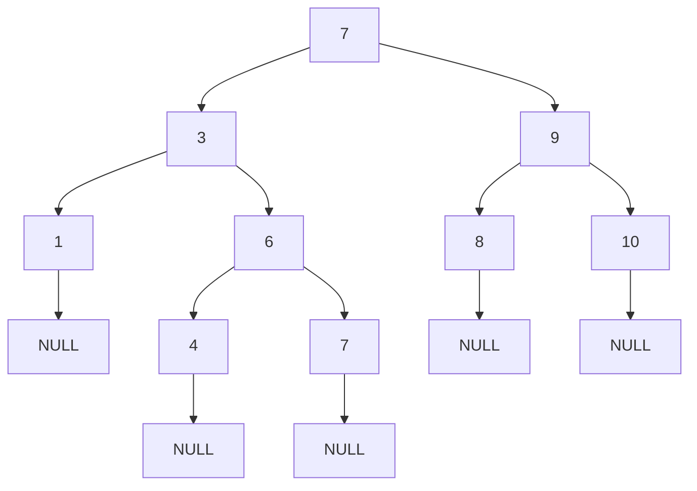
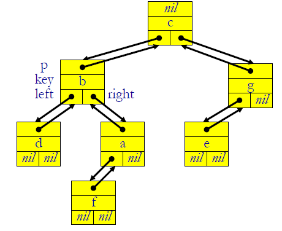

## L'operatore *XOR (OR esclusivo)*

L'operatore *XOR*, rappresentabile anche con il simbolo `⨁` o il simbolo `^`, rappresenta quello che nel linguaggio naturale è "o uno o l'altro".

| A    | B    | X    |
| ---- | ---- | ---- |
| 0    | 0    | 0    |
| 1    | 1    | 0    |
| 1    | 0    | 1    |
| 0    | 1    | 1    |

Questo simbolo ha anche proprietà associative:

* `A ^ B ^ C = (A ^ B) ^ C = A ^ (B ^ C)`

* `A ^ 0 = A : A ^ A = 0`

Questo simbolo può essere usato ad esempio per scambiare due variabili senza la variabile temporanea:

```c++
tmp = x;
x = y;
y = tmp;

// usando l'operatore XOR
// x == A; y == B;
x = x ^ y; // x == A ^ B, y == B
y = x ^ y; // y == (A ^ B) ^ B
		   //   == A ^ (B ^ B)
           //   == A ^ 0 == A
           
x = x ^ y; // x == (A ^ B) ^ A 
		   //   == (A ^ A) ^ B

// Alla fine delle 3 assegnazioni si ottiene lo scambio di variabili senza variabile tmp. Queste sono operazioni a livello di bit.
```


## Algoritmi di Ricerca e Ordinamento

Lo scopo di un algoritmo di ricerca o di ordinamento è che eseguano l'operazione nel miglior modo possibile, nel minor tempo possibile e senza compiere errori. Questi tre punti sono molto difficili da mantenere assieme, soprattutto quando si inizia a parlare di grandi moli di dati.

Per capire se un algoritmo è efficiente o meno però dobbiamo trovare un modo per valutarne l'esecuzione. Infatti se si esegue su due computer diversi, oppure se si calcolano moli di dati diverse, il funzionamento e il tempo di esecuzione possono cambiare notevolmente. 

Per questo adesso facciamo un analisi statica sul solo tempo di esecuzione di un algoritmo, senza contare l'hardware su cui lavora. Possiamo rappresentare quindi due algoritmi che hanno un *numero di istruzioni* che devono eseguire per ogni dato. Rappresenteremo con *N* il numero dei dati. Come si vede dall'esempio sotto il calcolo avviene più velocemente su un architettura che esegue meno istruzioni al secondo perché ha ricevuto un implementazione migliore.


Inoltre questo ci fa capire che con due algoritmi diversi, se uno è più efficiente lo è sempre tralasciando l'architettura. 

Ci sono classi di algoritmi che sono studiati da anni per essere i migliori. Ormai infatti esistono algoritmi ottimizzati al massimo per qualsiasi cosa. 


### Algoritmi di ricerca

L'algoritmo di ricerca è un algoritmo che permette di trovare  un elemento avente determinate caratteristiche tra un insieme di elementi. Gli elementi dell'insieme sono caratterizzati da una *chiave* e da un gruppo di *dati satellite*. Negli algoritmi di ricerca i dati satellite di solito si ignorano perché non sono utilizzati nella ricerca. Di conseguenza la chiave dell'elemento acquista una certa importanza, siccome è quella cosa che deve eguagliare l'elemento ricercato. Inoltre la chiave può essere *univoca* o *multipla*, cioè se esiste una sola o più volte nel gruppo di elementi. Di conseguenza nella ricerca bisogna tener conto se si sta cercando un singolo elemento, l'ultimo, uno in particolare o se invece deve restituire tutti i risultati. Per questo bisogna stare attenti ad usare l'algoritmo corretto adeguato al comportamento che ci si aspetta.


#### Analisi Complessità della *ricerca sequenziale*

Dato un determinato insieme di input e un algoritmo, può accadere che due machine astratte diano luogo a tempi di esecuzione diversi. Di conseguenza si parla di complessità dell'input e se ne distinguono 3 casi:

1. Caso medio
2. Caso peggiore
3. Caso migliore


Nella ricerca sequenziale accade che:

1. Nel *caso peggiore* l'elemento cercato è l'ultimo rispetto all'elemento di partenza, quindi il numero di passi necessari a raggiungerlo è uguale al numero degli elementi.
2. Nel *caso migliore* l'elemento cercato è il primo rispetto all'elemento di partenza, quindi il numero di passi necessari al suo raggiungimento è 1.
3. Nel *caso medio* compaiono tutti gli altri casi, che possono essere semplificati con la metà dei valori di input. 

E questa descrizione vale solo se io sto cercando la *prima occorrenza*, infatti se devo trovare tutte le volte che compare un certo valore la complessità sarà sempre uguale al numero di elementi, perché non avrò mai la garanzia che tra quelli non controllati non ci sia un'altra occorrenza. In questo caso quindi la *complessità* media, migliore o peggiore è *N*.


Un implementazione di questo algoritmo potrebbe essere:

```c++
int SequentialSearch(char* item, int cout, char key){
    register int t;
    for (t=0; t<count; ++t){
        // questo algoritmo esce alla PRIMA occorrenza dell'elemento cercato
        if (key == item[t]) return t;
    }
    return -1; // nessuna occorrenza!
}

/*       --- 
 * VARIANTE CON SENTINELLA (se arrivo alla sentinella arrivo sono alla fine)
 *       --- 
 * faccio un array con N elementi in cui cercare e (N+1) = elemento cercato, facendo così posso fare la ricerca con un solo elemento.
 */
int SequentialSearchGuard(char* item, int count, char key){
    
    register int t;
    // Aggiorno il valore sentinella
    item[count] = key;
    // con una sola condizione verifico se sono alla fine o se ho trovato l'elemento
    // fa avanzare t finchè è uguale alla cella o se è vuoto
    for (t = 0; key != item[t]; ++t){
    	if (t<count) return t; // found
    		else return -1;	  // not found
	}
}
```

E va notato che è indifferente in questi archivi decidere se scorrere da destra a sinistra o da sinistra a destra. La keyword `register` indica di salvare il valore nella memoria più veloce possibile.

Inoltre l'implementazione con la sentinella permette di ridurre le condizioni che vengono controllate all'interno del ciclo, ottimizzando il numero di confronti. La complessità dell'algoritmo però non cambia anche se abbiamo ridotto le condizioni da valutare.


#### Analisi Complessità della *ricerca sequenziale in una sequenza ordinata* 

Nella ricerca sequenziale di prima non avevamo dei punti di riferimento rispetto allo stato dell'input, quindi non sapevamo caratterizzarlo e neanche in che luogo poterlo andare a prenderlo.

Se invece usassimo un archivio ordinato rispetto a un elemento ad esempio dal più grande al più piccolo, avremmo potuto sapere qualcosa dello stato dell'input e quindi avere un punto di partenza per dove iniziare a cercare. 

Per questo motivo un altro algoritmo è quindi la *ricerca in una sequenza ordinata*. Gli algoritmi che ricercano in un insieme di dati ordinati sono avvantaggiati perché permettono innanzitutto di fermare la ricerca nel caso in cui il valore cercato è fuori dal range e in secondo luogo permettono di trovare subito se ci sono ricorrenze. 

Ad esempio in un insieme di numeri, se dovessi trovare il valore 7 e avessi già passato il valore 8 saprei che mi posso fermare. E allo stesso modo, se sto cercando una ricorrenza del valore 6, ma dopo il singolo elemento con questo valore ne trovo uno maggiore a lui, allora so che il valore 6 compare solo una volta nell'insieme.

Un implementazione tipo di questo algoritmo può essere

``` c++
int SequentialSearchSorted(char* item, int count, char key){
	
    register int t;
    t=0;
    while( (t<count) && (key>= item[t])){
        if (key == item[t]) return t;
        t++;
    }
    return -1;
    
}
```

Questo algoritmo permette quindi di eliminare il dovere di scorrere sempre tutto l'insieme dei valori nel caso in cui voglio trovare tutte le ricorrenze, ma non permette però di diminuire la complessità. Infatti, se il cercassi un valore che è l'ultimo rispetto al mio valore di partenza io dovrei sempre scorrere tutto l'insieme (descrizione del caso peggiore).


### Algoritmo di ricerca binaria:

La ricerca binaria, che si può chiamare anche dicotomica, necessita di un accesso casuale ai dati ordinati, di conseguenza non vanno bene strutture astratte come la lista. Con questi requisiti si può cercare l'elemento centrale di un insieme ordinato e in base al valore di questo elemento si cerca avanti o dietro questo elemento. Usando questa tecnica si dimezza l'insieme in cui si sta cercando ad ogni operazione.


L'implementazione tipica di questo algoritmo è:

```c++
mid = (TOP + BOTTOM)/2;

// confronto su questo elemento:
if (mid == ElCercato) return OK;
if (mid < ElCercato){
    // si sposta la ricerca nella metà superiore dell'insieme
    BOTTOM = (mid+1);
    TOP = TOP;
    mid = (TOP + BOTTOM)/2;
    if (mid < mid){
        ... // si continua in questo modo all'infinito (sotto scritta meglio questa funzione)
    }
}
// logicamente esiste anche il caso mid>ElCercato 
if (mid > ElCercato){
    ...;
    TOP = (mid-1);
    ...; // tutto uguale il resto
} // che esegue esattamente le stesse cose, prendendo però solo il sottoinsieme superiore.
/* cosa succede se non esiste l'elemento
 * Arrivo a un caso in cui BOTTOM > TOP, in questo caso posso fermarmi perchè viene meno la definizione di BOTTOM e di TOP

// La chiave di questa ricerca quindi sono gli indici e l'ordinamento dell'insieme.

```

Un implementazione tipo dell'algoritmo di ricerca binaria:

```c++
int BinarySearch(char* item, int count, char key){
	int bottom, top, mid;
    bottom = 0;
    top = count -1;
   	// creo un ciclo finché BOTTOM e TOP non si invertono
    while (bottom <= top){
        mid = (bottom+top)/2; // Mid è sempre l'elemento centrale per ogni ciclo
        if (key<item[mid]) top = mid-1; // se la cosa cercata è minore dell'elemento in mezzo, allora si prende il sottoinsieme sotto
        	else if(key>item[mid]) bottom = mid+1;
        // se la cosa cercata è maggiore del MID, allora si prende il sottoinsieme superiore
        else return mid; // FOUND
    }
    return -1; // Non trovato
}
```

Bisogna notare che:

* le keyword `TOP`, `BOTTOM` e `mid` servono ad indicare rispettivamente l'elemento finale, iniziale e centrale dell'insieme.
* la funzione è facilmente implementabile anche in modo recursivo

Qual è la complessità della ricerca binaria/dicotomica:
$$
O(log_2(n))
$$
Nel caso peggiore dobbiamo fare questo numero di operazioni per trovare l'elemento.

Questa inoltre è la prova che il logaritmo di ricerca dicotomica va meglio della ricerca sequenziale.

Si ricorda che la crescita logaritmica permette di avere un tempo di esecuzione che cresce molto lentamente rispetto al numero di dati inseriti rispetto ad altri algoritmi.


### Analisi dei Tempi di Esecuzione:

$$
Tempo di Esecuzione = T(N)
$$

Dove si prende N la dimensione dei dati di ingresso, e assumiamo che si prenda il numero di istruzioni come dipendenza per il tempo di esecuzione. (Ovvero non consideriamo aspetti dinamici dell'esecuzione dell'algoritmo).

Queste funzioni, che appunto indicano il tempo di esecuzione, possono avere molti elementi che le compongono, che possono contare di più o di meno.

Es:
$$
T(N) = 1 + N + N^2 + log(N)
$$
In cui:

* 1 = Elemento costante
* N = Componente lineare
* N^2 = parte quadratica, nonché quella che cresce più velocemente

Spesso però non servono queste funzioni dirette, ma alcune funzioni che permettano di delimitare la crescita di una funzione. Per questo ci viene in aiuto la notazione *O* (anche chiamata *BigO*).

Questa notazione fornisce il limite superiore ad una funzione, anche delimitatamente in un intervallo.
$$
f(n) = O(g(n))
$$


Mentre un'altra funzione ci permette di ingabbiare questa funzione dal basso.
$$
f(n) = Ω(g(n))
$$
Unendo queste due funzioni, si ottiene una terza funzione che, dato che riesce a indicare i massimi punti che toccherà con *O*, e i minimi punti con *Ω*, allora la funzione che ne risulta sarà una stima della funzione stessa (ovvero f(n) si comporterà più o meno come g(n)).
$$
f(n) = Ɵ(g(n))
$$
Tutti questi ragionamenti, logicamente valgono in intervalli limitati.

#### Ricapitolando

* abbiamo il **caso peggiore/minore/medio** di T(n) a seconda dell'input.
* La notazione **O/Omega/Theta** che indica invece come la funzione si approssima.

Esempi:

* la T(n) di un'operazione *push()* su uno stack:
  $$
  Ɵ(1)
  $$
  ( Per quando male, andrà sempre uguale).

* Inserimento di un elemento in una coda FIFO in un array circolare: 
  $$
  Ɵ(1)
  $$

* Ricerca sequenziale in un array non ordinato, nel caso peggiore
  $$
  Ɵ(N)
  $$

* Ricerca sequenziale in un array non ordinato, caso medio:
  $$
  Ɵ(1)
  $$

### Algoritmi di ordinamento

L'ordinamento degli array o degli insieme è spesso richiesto affinché siano efficienti i calcoli su questi insiemi o per l'esecuzione di alcuni algoritmi che necessitano di un insieme ordinato, come ad esempio la ricerca dicotomica. Alcuni problemi invece necessitano di questi algoritmi per essere risolti, come il problema della ricerca della mediana.

In questa sezione vedremo gli esempi più importanti di algoritmi di ordinamento con rispettiva analisi della complessità. Questa analisi sarà fatta sia per il calcolo del *T(n)* e del *O*.

In particolare vedremo l'**insertion-sort** e il **merge-sort**, che rappresentano anche due macroclassi di complessità per gli algoritmi.

#### Algoritmo *insertion-sort*:

Questo algoritmo è efficiente per array di piccole dimensioni, quindi non è sempre una via da escludere rispetto agli altri. Concettualmente è come prendere una carta alla volta e posizionarle correttamente in un altro mazzo, quindi il problema più grande è quello di non creare disordine nel mazzo, in modo che poi le carte che verranno inserite dopo siano al posto giusto.

Le operazioni che eseguirò sono:

* estraggo il primo valore (A) e lo posiziono all'inizio
* estraggo il secondo valore: se questo è maggiore lo metto dopo l'elemento precedentemente posizionato e se questo è minore lo metto prima. Questa operazione si può anche descrivere come un confronto tra l'ultimo elemento ordinato e il primo elemento non ordinato.


E la complessità asintotica dell'algoritmo è:

* nel caso *medio*:  

$$
Theta(N^2)
$$

* nel caso *peggiore* (ovvero quando devo completamente girare l'array):

$$
Theta(N^2)
$$

Questo impone all'algoritmo di essere efficiente solo con *N* sufficientemente piccoli.

La complessità prende questo valore perché ho due cicli annidati, come si vede anche nel codice: uno che scorre l'array di partenza e uno che scorre l'array di arrivo.

```c++
void InsertionSort(A){
    n = DimensioneArray(A);
    for (int j=1; j<n; ++j){
        // Prendo la carta da inserire
        x = A[j];
        // Secondo indice, quello del ciclo annidato. é anche l'indice superiore, che indica il sottoArray tra 0->(j-1).
        i = j-1;
        /* controllo di non essere alla fine dell'array.
         * Quando trovo il caso in cui x < ElementoArray[i], allora
         * assegno la carta a quel posto
         */
        while( (i >= 0) && (x<A[i])){
            A[i+1] = A[i];
            i = i-1;
        }
        // Prendo la prossima carta.
        A[i+1] = x;
    }
}
```


##### Analisi di complessità del *insertion-sort*: 

Posso eseguire un calcolo sulla complessità dell'algoritmo in modo statico, attraverso la logica dei cicli e assegnando a ogni linea il contributo sulla complessità:

```c++
void InsertionSort(A){
    n = DimensioneArray(A);
    for (int j=1; j<n; ++j){		  // c1*n
        x = A[j];				  	 // c2*(n-1)
        i = j-1;				   	 // c3*(n-1)
        while( (i >= 0) && (x<A[i])){ // c4 * (sommatoria da j=2 a n di tj)
            A[i+1] = A[i];			 // c5 * (Sommatoria da j=2 a n di (tj-1))
            i = i-1;  				// c6 * (Sommatoria da j=2 a n di (tj-1))
        }
        A[i+1] = x;					// c7 * (n-1)
    }							 // ------------------------
}								// La somma di queste complessità porta alla funzione T(n), dove n è il numero di operazioni.

```

Da questa ne esce un un insieme di equazioni contenente *c* con un valore numerico che sono costanti, e una serie  con *t* che segna il numero delle operazioni per *j* volte. 

Per arrivare a delle equazioni calcolabili, introduciamo, per logica la complessità nel *caso migliore* che è: 
$$
t_j = 1
$$

perché il primo confronto è già falso, quindi non eseguo mai il corpo istruzioni del `while`. Questa situazione si può anche descrivere dicendo che in questo caso *l'array è ordinato in partenza*. 

Sapendo questo dato posso tradurre le equazioni di complessità come:

```c++
void InsertionSort(A){
    n = DimensioneArray(A);
    for (int j=1; j<n; ++j){		  // c1*n
        x = A[j];				  	 // c2*(n-1)
        i = j-1;				   	 // c3*(n-1)
        while( (i >= 0) && (x<A[i])){ // c4*(n-1)
            A[i+1] = A[i];			 // 0
            i = i-1;  				// 0
        }
        A[i+1] = x;					// c7 * (n-1)
    }							 // ------------------------
}								// quindi posso calcolare e trovare Omega.
```

Che quindi è rappresentabile: (Dove *T* rappresenta il numero di operazioni per *N* elementi)
$$
T(n) = (c1+c2+c3+c4+c7) * n = bn + a = Θ(n)
$$
Da questo posso dedurre che la complessità del caso migliore è lineare.


Eseguiamo adesso lo stesso calcolo nel caso sia preso in considerazione il *caso peggiore*, cioé: 
$$
t_j = n
$$
Questa operazione significa che io devo completamente girare il mio array di valori, e di conseguenza il numero di operazioni è uguale al numero dei valori che questo array contiene.

Da questa relazione possiamo quindi tradurre il *caso generale* e trovare la complessità del caso peggiore:

```c++
void InsertionSort(A){
    n = DimensioneArray(A);
    for (int j=1; j<n; ++j){		  // c1*n
        x = A[j];				  	 // c2*(n-1)
        i = j-1;				   	 // c3*(n-1)
        while( (i >= 0) && (x<A[i])){ // c4*(sommatoria da j=2 fino a n)
            A[i+1] = A[i];			 // 0
            i = i-1;  				// 0
        }
        A[i+1] = x;					// c7 * (n-1)
    }							 // ------------------------
}								// Posso calcolare


```

Che si traduce in:
$$
T(n) = c_1n+c_2n+c_3(n-1)+c_4\sum_{j=2}^{n} j + c_5\sum_{j=2}^{n}(j-1) + c_6\sum_{j=2}^{n}(j-1) + c_7(n-1)
$$
Poi si sa che:
$$
\sum_{j=2}^{n} j = {n(n+1) \over 2} -1
$$

$$
\sum_{j=2}^{n} (j-1) = {n(n+1) \over 2} - n = {n(n-1) \over 2}
$$

Possiamo quindi tornare e sostituire i contributi:
$$
T(n) = c_1n+c_2(n-1)+c_3(n-1)+c_4({n(n+1) \over 2} - 1) + c_5({n(n-1) \over 2})  + c_4({n(n-1) \over 2})  + c_7(n-1)
$$

$$
T(n) = {1 \over 2}(c_4*c_5+c_6)n^2 + (c_1+c_2+c_3+{1 \over 2}c_4 - {1 \over 2}c_5 - {1 \over 2}c_6 + c_7)n -c_2 -c_3-c_4-c_7 \\\\
= c'n^2+b'n+a' \rightarrow Θ(n^2)
$$

Con queste ultime operazioni siamo quindi riusciti a definire il comportamento dell'*insertion-sort*, trovando il suo valore asintotico.


##### Categorie di algoritmi che si comportano come l'*insertion-sort*:

Ricapitolando, l'*insertion-sort* è un algoritmo che:

* fa l'ordinamento *sul posto*, usa quindi un solo array senza necessità di array d'appoggio.
* confronta e scambia tra loro elementi consecutivi dell'array.

Da queste informazioni possiamo dedurre che:

**Teorema:** La *complessità nel caso peggiore* per ogni algoritmo di ordinamento che si comporta come l'**insertion-sort** è al massimo:
$$
Θ(n^2)
$$


Algoritmi più efficienti richiedono scambi tra elementi distanti dall'array.


#### Algoritmo di *merge-sort*:

L'algoritmo di *merge-sort* si comporta nel caso peggiore:
$$
Θ(n * log(n))
$$
e ha la particolarità di unire due concetti:

1. la ricorsione
2. Divide et Impera (operazione di fusione per unire i sotto-array)

Come funziona:

* si prende l'array e si divide in due metà, si creano quindi due sotto-problemi
* continuo a dividere ancora in due sotto-array finché non arrivo alla soluzione base, ovvero un sotto-array di dimensione 1.
* Arrivato all'array di 1 elemento, allora restituisco l'array ordinato. 
* Da questi due array diversi unisco (*merge*) e genero un array che è la somma nell'ordine corretto degli array in ingresso.

```c++
// Array = A, indice destro = p, indice sx = r
MergeSort(A, p, r){
	if(p<r){
		// trovo il punto centrale -> DIVIDE
        q = Floor((p+r)/2);
        // Sottoinsieme sx -> Chiamata ricorsiva (IMPERA)
        MergeSort(A, p, q);
        // Sottoinsieme dx -> Chiamata ricorsiva (IMPERA)
        MergeSort(A, q+1, r);
        // Unisce i due sottoinsieme -> Funzione principale
        Merge(A, p, q, r);
	}
    // caso base
}

// Vettore A, indici p, w, r = dx, centrale, sx
Merge(A, p, q r){
    // Sottoarray sinistro
    n1 = q-p+1;
    // Sottoarray destro
    n2 = r-q;
    // tutti questi elementi tra p-q-r sono ordinati!
    int j, i;
    // Riempio gli array
    for (i=0; i<n1; ++i){ L[i] = A[p+i]; }
    for (j=0; j<n2; ++j){ R[j] = A[q+1]; }
    // Valore sentinella
    L[n1] = R[n2] = MAXINT;
   // aggiorno intanto che faccio i confronti
    i=j=0;
    // r - p+1 passi
    for(int k=p, k<=r; ++k){ 
        if ( L[i] <= R[j] ){
            A[k] = L[i];
            i++;
        } else{
            A[k] = R[j];
            j++;
        }
    }
}
```


 ##### Analisi dei tempi di esecuzione del *merge-sort*:

Principalmente si prende in considerazione il tempo della funzione `Merge()`:
$$
T_{merge}(n) = Θ(n) \\
Θ(n) = Θ(r-p+1)
$$
Quindi nel caso peggiore, l'algoritmo di *merge-sort* ha complessità 
$$
Θ(n log(n))
$$
Questo valore arriva per il calcolo delle complessità in funzioni ricorrenti, dove si mette a sistema il caso base e il caso ricorsivo:
$$
T(n) =
\bigg \{
\begin{array}{}
Θ(1) \text{ Se } n \leq c \\
aT({n \over b}) + D(n) + C(n)  \\
\end{array}\\
$$
Dove:

*  `c`: costante piccola
*  `a` : numero sotto-problemi generato dal passo *divide*
*  `1/b` : dimensione dei sotto-problemi rispetto a quello a quello originale
*  `D(n)` : Tempo/Risorse impiegato per dividere i problemi in sotto-problemi (operazione di `Floor`)
*  `C(n)` : Tempo impiegato per ricombinare le sotto-soluzioni

Nel caso di *merge-sort* l'equazione di ricorrenza ha i seguenti parametri:
$$
a = 2 \\
b=2\\
T_{MergeSort}(n) = 
\bigg \{
\begin{array}{}
Θ(1) \text{ Se } n \leq c \\
2T({n \over 2}) + D(n) + C(n)  \\
\end{array}\\
$$
Il termine *divide* ovvero `D(n)`, corrisponde al calcolo della metà (cioè quello che restituisce `Floor`)
$$
D(n) = Θ(1) \text { (è un valore costante)}\\
\text{Impera: } = 2T({n \over 2}) \\
C(n) : \text {Operazione combinazione/fusione} \\
C(n) = Θ(n)
$$
E a questo punto siccome `a=b=2` e ricordando che dall'operazione sopra ci risulta questo:
$$
Θ(n) \leftarrow C(n) = Θ(n) \\
Θ(n) \leftarrow D(n) = Θ(1)
$$

possiamo scrivere che:
$$
T_{MergeSort}(n) = 
\bigg \{
\begin{array}{}
Θ(1) \text{ Se } n \leq c \\
2T({n \over 2}) + Θ(n) \\
\end{array}\\
$$


Ma nel caso dell'*insertion-sort* ottengo un polinomio, quindi non riesco a trovare la complessità statica totale. 

Le equazioni di ricorrenza si possono essere risolte in vari modi ad esempio la sostituzione o l'albero di ricorsione.

##### Risoluzione della complessità della ricorsione con il *metodo dell'albero di ricorsione*

Dal sistema di prima possiamo fare alcune deduzioni:

* il significato di *Θ(1)* è che si approssima a una funzione lineare, che vuol dire una funzione costante
* quindi si può sostituire *Θ(1)* con *C* e *Θ(n)* con *Cn*

Da queste deduzioni otteniamo dei termini espliciti:
$$
T_{MergeSort}(n) = 
\bigg \{
\begin{array}{}
C \text{ Se } n = 1 \\
2T({n \over 2}) + Cn \text{ Se n>1} \\
\end{array}\\
$$


Che si può risolvere attraverso la creazione di un *albero di ricorsione*:


E si continua in questo modo finché non si è trovato il caso di base, che costa *c*, di conseguenza l'ultimo "piano" di rami dell'albero sono *n* foglie che costano ognuna *C*. (quindi  *n\*C*)

Poi dovremmo calcolare il numero di livelli che impiego ad arrivare al caso base e il rispettivo costo.

Dovremmo risolvere 3 problemi quindi:

1. Calcolare il numero di livelli
2. Calcolare il numero delle foglie
3. calcolare il costo di *Ci* (costi di ciascun livello)

Se risolviamo 1, 2, 3 troviamo *T(n)* sommando i costi di tutti i livelli, inclusi i costi delle foglie.

Il costo di ciascun livello si può scrivere anche in questo modo:
$$
C_1 \rightarrow Cn \\
C_2 \rightarrow C(n/2) + C(n/2) = Cn \\
C_3 \rightarrow C(n/4) + C(n/4) + C(n/4) + C(n/4) = C(n) \\
$$
Che in generale:
$$
C_i = 2^i * c\big({n \over 2^i}\big) = cn \\
C_{NumLivel.} := cn
$$
Quindi il costo di ciascun livello del *merge-sort* è *Cn*. Di conseguenza:
$$
T(n) = \sum_{i}^{NumLivel} C_i
$$
Il calcolo dei numero dei livelli viene fatto per *induzione*: (si conosce la soluzione per un caso base e si risolve per un caso generico). Cioè:

IPOTESI: 
$$
NumLivelli = log_2(n+1)
$$
 da questo, il CASO BASE:
$$
n = 1 \\
NumLivelli = 1 = 0+1 \rightarrow OK!
$$
CASO INDUTTIVO:
$$
n = 2^i \\
NumLivelli = log(2^i+1) = i+1
$$
Noi sappiamo che ogni volta che passiamo di livello, moltiplichiamo per due nel livello successivo, quindi:
$$
ProssimoN : n=2^{i+2} \\
n = 2^{i+1} \\
(i+1) +1 = log_2(2^{i+1}) + 1
$$
 Che quindi dimostra la formula per il caso bersaglio che stavamo cercando.

Con questo possiamo descrivere il caso induttivo. Da questo ragionamento arriviamo nell'ultimo caso, nel quale dobbiamo sommare tutti le somme parziali dei livelli:
$$
\sum_i^{NulLivelli}C_i \\
T(n) = cn * NumLivelli = cn * (logn +1) \\
 = cnlog(n) + cn = - (nlog(n))
$$
E con questa si dimostra come il *merge-sort* ha complessità costante, sia nel caso peggiore che nel caso migliore e vale:
$$
Θ(nlog(n))
$$


##### Risoluzione della complessità della ricorsione con il *metodo della sostituzione*

Come prima partiamo dalla complessità della funzione che è:
$$
T_{MergeSort}(n) = 
\bigg \{
\begin{array}{}
Θ(1) \text{ Se } n \leq c \\
2T({n \over 2}) + Θ(n) \\
\end{array}\\
$$


Voglio dimostrare che *T(n) = Θ(nlog(n))*.

Dimostrare per induzione che:
$$
T(n) = cn*log(n) \text{ per } c < 0 
$$
Assumo che il CASO BASE:
$$
T(1) = Θ(1)
$$
e il CASO INDUTTIVO:

Assumo che la diseguaglianza valga per n<k. Che quindi
$$
T(n) \leq cn*log(n)
$$
Dimostrare che questa sopra vale per n=k, in particolare n=K/2.
$$
T({k \over 2}) \leq c{k \over 2}log({k \over 2})
$$
La ricorsione ci dice che:
$$
T(k) = 2T({k \over 2}) + k \\
T(k) \leq 2c({k \over 2})log({k \over 2}) + k \\
T(k) \leq ck(log(k)-log(2)) + k \\
T(k) \leq cklog(k) - ck + k \\
T(k) \leq cklog(k) + k(1-c) \\
T(k) \leq cKlog(k) +(1-c)k \\
T(k) \leq cklog(k) \\
\text{ per } c \geq 1
$$
Questo vuol dire che l'assunto vale per *k>n*, rispetto all'ipotesi che era più ristretta.


#### Ricapitolando *algoritmi di ordinamento* 

Gli algoritmi di ordinamento sono dipendenti:

1. dal tipo di elementi da ordinare
2. dal verso di ordinamento: crescente o decrescente

Inoltre il *teorema dell'insertion-sort* afferma che i metodi basati su confronti e scambi sul posto che ordinano una sequenza di *N* numeri non può fare meglio che *Θ(N^2)* [Esempio: InsertionSort, BubbleSort].

Mentre con gli algoritmi basati sui confronti si può arrivare nel caso *peggiore* a complessità *Θ(nlog(n))*. [Esempio MergeSort, QuickSort].

Inoltre si può anche dimostrare che **tutti i metodi per confronto hanno metodo ottimale al massimo come *nlog(n)***. 

Per migliorare ancora la complessità di algoritmi di ordinamento quindi bisogna abbandonare il metodo dei confronti e si può arrivare a complessità inferiore a *nlog(n)*. [Esempio CountingSort, RadixSort, BucketSort].


## Alberi Binari di Ricerca

La struttura chiamata *albero binario di ricerca* è stata creata per semplificare la ricerca in un insieme di moltissimi elementi, attraverso un particolare tipo di indicizzazione. Queste tecniche usate assieme permettono di avere una struttura che ha un tempo medio di ricerca di un elemento di $\Theta(logn)$. Allo stesso modo, sono possibili anche le operazioni di inserimento e cancellazione, anche se più complicate.




Questo in alto è la rappresentazione di un albero binario di ricerca, in cui si può notare che ogni valore che è maggiore di un determinato nodo finisce nel suo sotto-albero sinistro, mentre chi è minore del valore del nodo finisce nel sottoalbero destro (anche se questa è una convenzione, perché può benissimo venir implementato all'inverso). L'aggettivo binario invece sta a indicare come ogni nodo abbia due sotto-alberi.

I rapporti di minore, maggiore e uguale vanno mantenuti sempre, dal momento dell'inserimento a quello della cancellazione, infatti solo questo modo di agire permette all'albero di continuare a funzionare correttamente.

Tutti i rami di questo albero finiscono poi con un valore nullo, una casella vuota, che sta ad indicare che è terminato.

La rappresentazione su un albero binario non è univoca, cioè ho più modi di rappresentare lo stesso insieme di elementi.

Questa struttura al momento dell'implementazione prende questa forma in memoria:



Logicamente la forza dell'albero binario è che non è necessario passare attraverso tutti i valori, quindi nel caso in cui questo albero viene bilanciato male si diche che *l'albero degenera*, ovvero prende più la forma di una lista che di un albero.


### Visita o stampa delle chiavi

Presa come implementazione tipo quella di una lista doppiamente concatenata, possiamo definire ogni blocco come:

```c++
typedef struct Blocco{
  
  TipoDato dato;
  Blocco *right;
  Blocco *left;

}Blocco;
```

Altre implementazioni includono più puntatori, ad esempio quelli al padre, al nodo o ad altri elementi. Con questo tipo di codice invece abbiamo tutto il necessario per un corretto funzionamento senza eccedere nell'utilizzo della memoria.

Con questo tipo di organizzazione ci sono vari metodi per stampare gli elementi dell'albero binario:

Stampa **in ordine**, anche definito come attraversamento simmetrico. 

* Consiste nel nodo di destra, nel nodo al centro e poi nel nodo di sinistra.

* L'implementazione tipo, usando la ricorrenza è:

  ```c++
  void Inorder(Blocco* x){
    if (x != NULL){
      Inorder(x->left);
      cout >> x->dato;
      Inorder(x->right);
    }  
  }
  ```

  Dove il caso di base è `if (x == NULL)`

* La complessità di questo algoritmo è descritta da:
  $$
  \text{Caso Base: } T(0) = c \\
  \text{Caso Induttivo: } T(n) = (c+d)n + c
  $$
  Dove `c` e `d` sono costanti e `n` è il numero di nodi. Infatti questo si dimostra con il metodo della sostituzione dicendo che il caso base:
  $$
  T(0) = c = (c+d)*0 + c
  $$
  mentre il caso induttivo:
  $$
  T(n) = T(k) + d + T(n-k-1) = \\
  = (c+d)k +c+d+(c+d)(n-k-1)+c \\ 
  = (c+d)n + c
  $$
  Questo significa che il caso induttivo è la somma del tempo di esecuzione della costante ??


Stampa **in post-ordine**.

* Si stampa prima il sotto-albero sinistro, quello destro e infine la chiave

* L'implementazione tipo, usando la ricorsione:

  ```c++
  void PostOrder(Blocco* x){
    if (x != NULL){
      PostOrder(x->left);
      PostOrder(x->right);
      cout >> x->dato;
    }  
  }
  ```


Infine la stampa **in pre-ordine**.

* si stampa la prima la chiave, poi il sotto-albero sinistro, infine quello destro

* L'implementazione tipo, usando la ricorsione è:

  ```c++
  void PostOrder(Blocco* x){
    if (x != NULL){
      cout >> x->dato;
      PostOrder(x->left);
      PostOrder(x->right);
    }  
  }
  ```


### La ricerca di una chiave

Nell'algoritmo di ricerca si deve si trovare un elemento, o più di uno, che corrisponda alle caratteristiche cercate. Questa idea si deve sviluppare anche tenendo conto delle proprietà dell'albero binario.

Un implementazione tipo di questo algoritmo potrebbe essere:

```c++
Blocco Search(Blocco* x, TipoDato k){
  
  if (x == NULL || k == x->dato){ return x; }

  if (k<x){ return Search(x->left, k); }
  
  if (k>x){ return Search(x->right, k); }
}
```

Questa implementazione restituisce `NULL` se non trova nessun elemento, mentre invece stampa la prima ricorrenza trovata.

La complessità di questo algoritmo è, *nel caso peggiore*, l'altezza dell'albero, cioè $\Theta(h)$. Questo significa che nel caso peggiore l'elemento cercato è o l'ultimo elemento a destra o l'ultimo elemento a sinistra. Di conseguenza la complessità aumenta linearmente con l'aumento dell'altezza dell'albero, da questo ne risulta che il buon bilanciamento dell'albero è molto importante. 


### Ricerca del Massimo e del Minimo

Questi algoritmi per la ricerca del massimo o del minimo consentono di trovare l'elemento con il valore più piccolo o più grande possibile all'interno dell'albero. Questi algoritmi poi tornano utili anche per altre funzioni più complesse. 

 Anche in questi casi la complessità del *caso peggiore* è l'altezza dell'albero, cioè anche in questi casi $\Theta(h)$.

Un implementazione tipo può essere:

```c++
TipoDato Minimo(Blocco* x){
  while(x->left != NULL){
   Minimo(x->left); 
  }
  return x;
}

TipoDato Massimo(Blocco* x){
  while(x->right != NULL){
   Minimo(x->right); 
  }
  return x;
}
```


### Ricerca del Successore e del Predecessore

Questo algoritmo deve tornare l'elemento il cui valore è subito successivo o subito precedente al valore. Questo significa che si deve trovare:

* se si sta cercando il *successore*: il valore più piccolo nel sotto-albero dei maggioranti
* se si sta cercando il *predecessore*: il valore più grande nel sotto-albero dei minoranti

Da queste definizioni si deduce anche che per questo algoritmo saranno utili quelli di ricerca del minimo e massimo.

Un implementazione tipo può essere:

```c++
Blocco Successore(Blocco* x){
	if (x->right != NULL){
    return Minimo(x->right);
  }
  
  Blocco* y = Padre(x);
  while( y != NULL && x == y->right){
    x = y;
    y = Padre(x);
  }
  
  return y;
}

Blocco* Padre(Blocco* Cursore, Blocco* x, Blocco* precedente){
  if (Cursore == x){ 
    return precedente;
  }
  else{
    if (x<Cursore)
    	Padre(Radice->right, x, Cursore);
    if (x>Cursore)
      Padre(Cursore->left, x, Cursore);
  }
}
```

* il primo blocco di codice con `if (x->right != NULL)` indica che se ci sono elementi sulla destra, cioè se esiste il blocco dei maggioranti allora si cerca il suo minimo. 
* Se non esiste il blocco dei maggioranti, allora si deve cercare un nodo più vicino alla radice che sia il più grande possibile. Da qui la necessità di inserire la funzione `Padre`, che in base alla struttura che si è decisa per l'albero può avere implementazioni diverse (ad esempio se ogni elemento dell'albero contiene anche un puntatore al suo padre, l'implementazione è molto basilare). In questo caso invece l'implementazione non è né semplice, né senza spreco di risorse.
  * La funzione continua ad avanzare di nodi, seguendo la regola dell'albero, finché non trova l'elemento cercato. A quel punto restituisce l'elemento precedente, che viene passato alle varie funzioni attraverso l'intestazione della funzione.
  * Ci sono altri modi per implementare questa cosa, più efficienti o meno.
* Non esiste la possibilità che questa funzione non trovi nulla, eccetto che l'albero sia completamente sbilanciato verso i minoranti e manchi completamente il sotto-albero di sinistra.

E l'algoritmo per trovare il predecessore:

```c++
Blocco Successore(Blocco* x){
	if (x->left != NULL){
    return Minimo(x->left);
  }
  
  Blocco* y = Padre(x);
  while( y != NULL && x == y->left){
    x = y;
    y = Padre(x);
  }
  
  return y;
}
```

che funziona allo stesso modo, ma nel sotto-albero opposto.

Entrambi questi algoritmi hanno una complessità di $\Theta(h)$, dove $h$ è l'altezza dell'albero.


### Ricerca dell'altezza dell'albero binario

Si definisce l'altezza dell'albero come la distanza massima tra la radice e ciascuna foglia, di conseguenza si devono calcolare tutte le distanze e prendere quella massima.

L'idea generale che sta alla base di questo algoritmo è che si deve attraversare a sinistra e a destra, calcolare le due altezze e poi prendere il massimo tra i due.

```c++
int AltezzaAlbero(Blocco* x){
  if(x == NULL) {
    return -1;
  } else {
    AltezzaSx = AltezzaAlbero(x->left);
    AltezzaDx = AltezzaAlbero(x->right);
    return max(Altezzasx, AltezzaDx);
  }
}

int max(int val1, int val2){
  if(val1 > val2)
    return val1;
  
  if (val2 > val1)
    return val2;
}
```

Della funzione per calcolare l'altezza dell'albero si può notare una somiglianza alla funzione di post-ordine.


### Inserimento di un nuovo elemento

La funzione per inserire il nuovo elemento è importante per lasciare intatta la struttura dell'albero e quindi continuare ad avere una struttura con una complessità di $\Theta(logn)$ per la ricerca. 

L'implementazione è:

```c++
void InserisciElemento(Blocco* T, Blocco* z){
  // se l'albero è vuoto inizializzo
  if(root(T) == NULL){
    root(T) = z;
  }else{
    InserisciElementoRic(root(T), z); 
  }
}

void InserisciElementoRic(Blocco* x, Blocco* z){
  if (z->dato < x->dato){
    if (x->left == NULL){
      z = x->left;
    } else {
      InserisciElementoRic(x->left, z);
    }
  }else{
    if (x->right == NULL){
      z = x->right;
    } else {
      InserisciElementoRic(x->right, z);
    }
  }
}
```

Nella funzione abbiamo nell'intestazione l'albero `T` e il nuovo blocco `z`, che verrà inizializzato come un nuovo elemento, con entrambi i puntatori a ` NULL`. E' importante ricordare che in questo caso, se l'elemento dell'albero richiede anche il padre, va aggiungo al momento.

Anche la complessità di questa funzione è legata all'altezza infatti è definibile come $\Theta(h)$. 


### Cancellazione di un elemento

La cancellazione di un elemento da un albero binario è forse l'operazione più difficile in assoluto in questa struttura di dati. Infatti bisogna predisporre la funzione per eseguire tre diverse operazioni in quattro situazioni ben distinte:

1. si vuole eliminare un elemento che non ha figli (caso base e anche il più semplice)
2. si vuole eliminare un elemento che ha un figlio
3. si vuole eliminare un elemento con due figli

Il lato positivo di queste operazioni però sta nell'operatività con i puntatori, questa cosa infatti permette di effettuare un cambio di link tra due elementi con la semplicità di una modifica ai puntatori giusti. Inoltre dovendo toccare solo i link che collegano i padri all'elemento, non ci si deve particolarmente preoccupare dei figli di II generazione.

Questo è un esempio di funzione in cui il puntatore a padre può semplificare molto le operazioni.

(Tutte le implementazioni possono essere fatte in vari modi, qui sto riportando alcuni modelli per dare un idea)

#### Eliminare un elemento senza figli

Se un elemento è senza figli vuol dire che è uno degli ultimi elementi dell'albero. Questo significa anche che non bisogna prestare particolare attenzione al comportamento dei figli, che non esistono. 

Le uniche operazioni necessarie quindi sono quelle di eliminare l'elemento e impostare il link del padre a questo elemento al valore `NULL`.

Un implementazione tipo può essere:

```c++
void EliminoElementoNoFigli(Blocco* ToBeDel){
	if (ToBeDel->dato > (Padre(ToBedel))->dato){
  	(Padre(ToBeDel))->right = NULL;
  } else {
    (Padre(ToBeDel))->left = NULL;
  }
  delete [] ToBeDel;
}
```


#### Eliminare un elemento con un solo figlio

Se un elemento ha un solo figlio vuol dire che quest'ultimo prenderà il posto del padre.

Un implementazione tipo può essere, quindi:

```c++
void EliminoElementoUNFigli(Blocco* ToBeDel){
	if (ToBeDel->dato > (Padre(ToBedel))->dato){
  	(Padre(ToBeDel))->right = (ToBeDel->right==NULL)? ToBeDel->left : ToBeDel->right;
  } else {
    (Padre(ToBeDel))->left = (ToBeDel->right == NULL)? ToBeDel->left : ToBeDel->right;
  }
  delete [] ToBeDel;
}
```


#### Eliminare un elemento con entrambi i figli

Il problema in questo caso è che bisogna trovare un elemento un elemento che mantenga inalterate le relazioni dell'albero, ovvero un elemento maggiore o uguale rispetto a tutti gli elementi sulla sinistra e minore di tutti gli elementi sulla destra.

Questo processo diventa molto facile se si utilizzano le funzioni di minimo e massimo:

* posso trovare il massimo tra i minimi e sostituirlo con il valore da eliminare
* posso trovare il minimo tra i massimi e sostituirlo con il valore da cancellare

Un implementazione di questa funzione può essere (in questo caso uso il minimo dei massimi):

```c++
void EliminoElementoDUEFigli(Blocco* ToBeDel){
	if (ToBeDel->dato > (Padre(ToBedel))->dato){
  	(Padre(ToBeDel))->right = Minimo(ToBeDel->left);
  } else {
    (Padre(ToBeDel))->left = Minimo(ToBeDel->right);
  }
  delete [] ToBeDel;
}
```


#### Unisco le funzioni di eliminazione

L'implementazione di un unica funzione per l'eliminazione permette la cancellazione di un elemento in qualsiasi caso questo sia posizionato. Per fare ciò abbiamo bisogno di una formulazione ricorsiva.

Un implementazione di questa funzione può essere:

```c++
bool Cancella(Blocco* Canc){
  if(Canc->left == NULL && Canc->right == NULL){
    
    if (ToBeDel->dato > (Padre(ToBedel))->dato){
  		(Padre(ToBeDel))->right = NULL;
 		} else {
    	(Padre(ToBeDel))->left = NULL;
  	}
    delete [] Canc;
    return true;
    
  } else if (Canc->left != NULL || Canc->right != NULL){
    
    if(Canc->left != NULL){
      if (ToBeDel->dato > (Padre(ToBedel))->dato){
  			(Padre(ToBeDel))->right = Canc->left;
 			} else {
    		(Padre(ToBeDel))->left = Canc->left;
  		}
    }else{
      if (ToBeDel->dato > (Padre(ToBedel))->dato){
  			(Padre(ToBeDel))->right = Canc->right;
 			} else {
    		(Padre(ToBeDel))->left = Canc->right;
  		}
    }
    
    delete [] Canc;
    return true;
    
  } else if (Canc->left != NULL && Canc->right != NULL){
    
    if (ToBeDel->dato > (Padre(ToBedel))->dato){
  		(Padre(ToBeDel))->right = Minimo(ToBeDel->left);
  	} else {
    	(Padre(ToBeDel))->left = Minimo(ToBeDel->left);
  	}
  	delete [] ToBeDel;
    return true;
    
  }  
}
```


### Altri tipi di Alberi

Il limite dell'albero binario di ricerca è lo sbilanciamento. Infatti questo può fare degenerare le prestazioni delle operazioni da $\Theta(h)$ a $\Theta(n)$ molto velocemente. 

Un modo per risolvere questo problema è l'uso di *alberi rosso-neri* che rappresentano uno dei modi in cui gli alberi binari di ricerca vengono bilanciati per ottenere operazioni di *insert* o *delete* su insiemi dinamici che chiedano tempo di $\Theta(logn)$ nel caso peggiore.

Un altro modo sono i B-alberi (ovvero che ogni elemento ha *tot* elementi, sempre) che sono alberi bilanciati particolarmente adatti per memorizzare grandi quantità di dati in memoria secondaria. Questi sono prediletti perché gli alberi *n-ari* non hanno particolari caratteristiche che permettono di diminuire il numero di passaggi nel normale uso, ma solo invece importanti in caso di specifici usi.

Questi alberi *n-ari* hanno la funzione di ricerca che ha complessità di $\Theta(log_m(n))$, dove $m$ è il numero di rami che ha ogni elemento.